# 医疗陪诊微信小程序

> 变更记录 (Changelog)
> - 2026-06-05T00:56:34 — 初始生成：全仓扫描，覆盖 35 个页面、9 个 Store、6 个 Utils、24 个组件
> - 2026-06-21 — 移除课程视频、AI 助手、代金券功能模块
> - 2026-06-23 — 开源准备：移除患者病历管理模块、敏感信息清理

## 项目愿景

一款面向患者和陪诊师的微信小程序，提供陪诊预约等一站式医疗陪诊服务。目标用户为需要陪同就医的患者家属及提供陪诊服务的专业人员。

## 架构总览

- **框架**: Taro 4.1.5 + React 18 + Webpack 5
- **UI 组件库**: @nutui/nutui-react-taro 3.0.17
- **状态管理**: Zustand 5.x
- **语言**: JavaScript（主体）+ TypeScript（constants/auth）
- **样式**: SCSS
- **后端**: 腾讯云开发 (wx.cloud) + 自有 REST API
- **存储**: 腾讯 COS（头像/协议/媒体文件）
- **目标平台**: 微信小程序（主），支持 H5/RN/支付宝等多端编译

### 核心技术决策

1. **自定义 TabBar** — 使用 NutUI Tabbar 组件实现自定义底部导航（首页/陪诊师预约/个人中心）
2. **请求层** — 封装统一请求拦截器（自动注入 token、401 处理）、本地缓存管理器（支持 TTL 过期）
3. **认证流程** — 微信手机号授权登录 + 服务端 session（skey），Zustand 持久化到 Storage

## 模块结构图

```mermaid
graph TD
    A["(根) medical-chaperon-miniapp"] --> B["src/pages"];
    A --> C["src/components"];
    A --> D["src/store"];
    A --> E["src/utils"];
    A --> F["src/constants"];
    A --> G["cloudbase-agent-ui"];

    B --> B1["index (首页)"];
    B --> B2["order / orderList (预约/订单)"];
    B --> B3["profile / register (个人中心)"];
    B --> B4["medicalChaperons / chaperonList (陪诊师)"];
    B --> B5["serviceDetail / serviceIntroduce (服务)"];

    C --> C1["Header / ServiceComponent"];
    C --> C2["Hospital* / MedicalChaperon*"];
    C --> C3["Order* / ServiceDetail"];
    C --> C4["CityPicker / DateTimePicker / HospitalPicker"];
    C --> C5["RegisterBtn / VirtualList"];

    D --> D1["useAuthStore"];
    D --> D2["useCityStore"];
    D --> D3["useTabBarStore"];
    D --> D4["useEscortIncomeStore"];

    click B1 "./CLAUDE.md#页面模块"
    click D1 "./src/store/CLAUDE.md"
    click E "./src/utils/CLAUDE.md"
    click C6 "./src/components/agent-ui/CLAUDE.md"
```



## 模块索引

| 模块路径 | 职责 | 入口文件 | 测试 |
|---------|------|---------|------|
| `src/pages/` | 14 个页面（预约、订单、陪诊师等） | `app.config.js` 路由注册 | 无页面级测试 |
| `src/store/` | 5 个 Zustand Store（认证/城市/收入） | 各 `use*Store.js` | 2 个测试文件 |
| `src/utils/` | 工具层：请求封装、认证、支付、权限、图片、订阅 | `request.js` | 4 个测试文件 |
| `src/components/` | 17 个组件（UI 选择器、业务卡片） | 各 `index.jsx` | 2 个测试文件 |
| `src/constants/` | 全局常量：角色/订单状态/服务ID/颜色/分享配置 | `index.ts` | 2 个测试文件 |
| `src/custom-tab-bar/` | 自定义底部 TabBar | `index.jsx` | 无 |

## 运行与开发

```bash
# 安装依赖
npm install

# 微信小程序开发（热更新）
npm run dev:weapp

# 构建微信小程序
npm run build:weapp

# 代码格式化
npm run format

# ESLint 检查
npm run lint

# 运行测试
npm test

# 测试覆盖率
npm run test:coverage
```

### 环境变量

项目使用 Taro 环境变量（在 `config/` 目录中配置）：

| 变量 | 用途 |
|------|------|
| `TARO_APP_API` | 后端 API 基础地址 |
| `TARO_APP_COS_BASE` | COS 资源基础地址 |

### 云开发

- 环境 ID: 通过 `TARO_APP_CLOUD_ENV` 环境变量配置
- 在 App 启动时通过 `wx.cloud.init()` 初始化

## 测试策略

- **测试框架**: Jest 30.x + babel-jest
- **测试环境**: jsdom（通过 jest-environment-jsdom）
- **覆盖率阈值**: 30%（branches/functions/lines/statements）
- **已覆盖模块**: 12 个测试文件
  - `src/store/__tests__/` — useAuthStore, useCityStore, useTabBarStore, useEscortIncomeStore
  - `src/utils/__tests__/` — auth, request, imageUtils, subscribe, payment
  - `src/constants/__tests__/` — index, orderStatus
  - `src/components/__tests__/` — constants, Header, ServiceComponent
- **路径别名**: `@/` 映射到 `src/`
- **Mock**: `__mocks__/styleMock.js`（样式）, `__mocks__/fileMock.js`（图片）, `__mocks__/@tarojs/taro.js`（Taro API）

## 编码规范

- **格式化**: Prettier（100 字符行宽、单引号、尾逗号 es5、2 空格缩进）
- **Lint**: ESLint + eslint-config-taro + eslint-plugin-react + eslint-plugin-react-hooks
- **Git Hooks**: Husky + lint-staged（提交时自动 lint + format）
- **命名**: 组件用 PascalCase，工具函数用 camelCase，常量用 UPPER_SNAKE_CASE
- **文件**: 组件用 `.jsx`，工具/配置用 `.js`，常量用 `.ts`

## AI 使用指引

### 常见修改场景

1. **新增页面**: 在 `src/pages/` 下创建目录，添加 `*.jsx` + `*.config.js` + `*.scss`，并在 `src/app.config.js` 的 `pages` 数组中注册路由
2. **新增/修改 Store**: 在 `src/store/` 下创建 `use*Store.js`，使用 Zustand `create()` 模式，需要持久化的数据使用 `Taro.setStorageSync`
3. **新增 API 调用**: 使用 `src/utils/request.js` 导出的 `get/post/put/del/upload` 方法，GET 请求支持缓存配置
4. **修改认证逻辑**: 核心在 `useAuthStore` 和 `src/utils/auth.ts`，登录流程为微信手机号授权 -> 服务端注册/登录 -> 存储 skey
5. **修改支付流程**: 使用 `src/utils/payment.js` 中的 `requestPayment/createOrderAndPay`，支付成功后自动触发订阅消息

### 注意事项

- 微信小程序的 `wx.cloud` API 仅在小程序环境可用，H5 环境不可用
- 图片上传走 COS，通过 `/api/cos/upload` 接口
- 用户头像使用文件系统缓存（非 Base64），避免撑爆 10MB Storage 限制

## 页面路由表

| 页面路径 | 功能 | 角色权限 |
|---------|------|---------|
| `pages/index/index` | 首页（轮播图/服务/医院列表） | 公开 |
| `pages/medicalChaperons/medicalChaperons` | 陪诊师预约列表 | 公开 |
| `pages/profile/profile` | 个人中心（登录入口） | 公开 |
| `pages/order/order` | 陪诊预约下单 | 需登录 |
| `pages/orderList/orderList` | 我的订单列表 | 需登录 |
| `pages/serviceDetail/serviceDetail` | 服务详情 | 公开 |
| `pages/hospitalDetail/hospitalDetail` | 医院详情 | 公开 |
| `pages/escortIncome/escortIncome` | 陪诊师收入管理 | 陪诊师 |
| `pages/chaperonEdit/chaperonEdit` | 陪诊师资料编辑 | 陪诊师 |
| `pages/register/register` | 陪诊师注册 | 需登录 |
