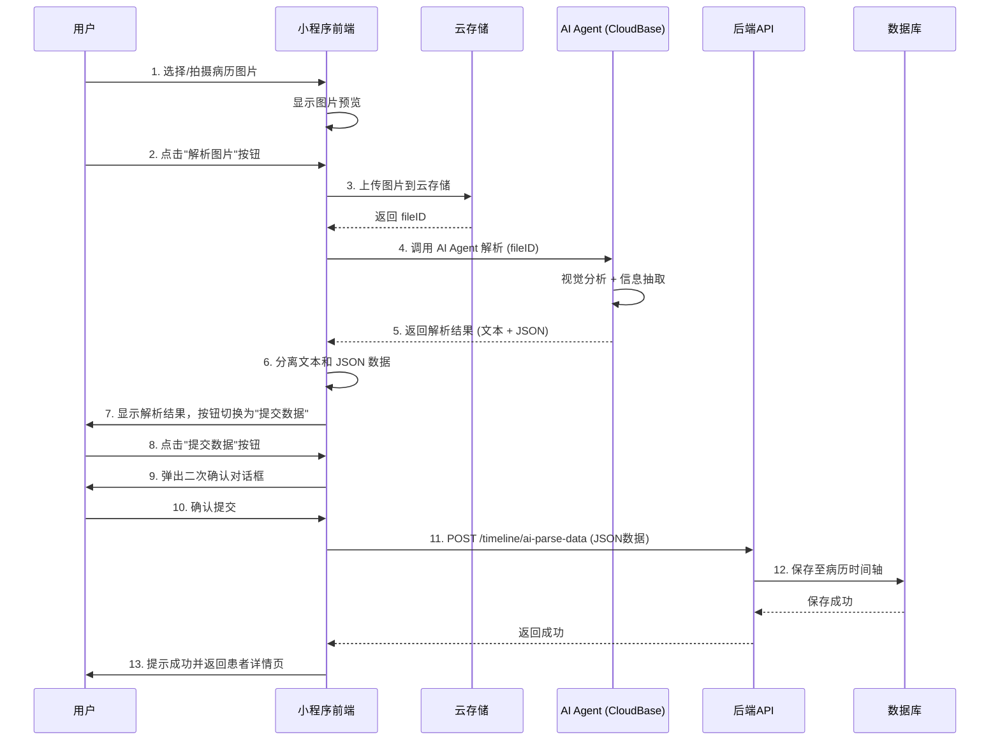

# AI病历解析功能详细设计方案 (Agent版)

## 1. 核心理念
采用 **"多模态 Agent + 结构化输出"** 模式，利用大模型（Vision LLM）的视觉理解和指令遵循能力，直接将非结构化病历图片转化为结构化 JSON 数据，替代传统的 OCR + 规则提取方案。

## 2. 业务流程设计



## 3. 功能模块详细设计

### 3.1 前端页面架构 (已实现 `src/pages/imageParse`)

#### 3.1.1 `src/pages/imageParse/imageParse.jsx` (图片解析页)
*   **UI 元素**：
    *   上传区域：大尺寸按钮，支持点击选择或拍摄图片
    *   图片预览：显示已选择的图片，支持点击预览
    *   操作按钮：
        *   "更换图片"按钮：重新选择图片
        *   "解析图片"按钮：开始 AI 解析（解析前显示）
        *   "提交数据"按钮：提交解析结果（解析后显示，蓝色）
    *   状态显示：
        *   加载动画：解析过程中显示
        *   步骤日志：显示当前解析步骤
        *   错误提示：显示错误信息
        *   解析结果：显示文本解析结果（支持长文本选择）
    *   提示信息：底部显示使用提示

*   **状态管理**：
    ```javascript
    const [imageUrl, setImageUrl] = useState('');           // 图片路径
    const [parsing, setParsing] = useState(false);          // 解析状态
    const [result, setResult] = useState(null);             // 解析文本结果
    const [jsonResult, setJsonResult] = useState(null);      // 解析 JSON 结果
    const [error, setError] = useState('');                 // 错误信息
    const [stepLog, setStepLog] = useState('');             // 步骤日志
    const [parseCompleted, setParseCompleted] = useState(false); // 解析完成状态
    const [botId] = useState('ibot-binglitu-l06q9i');      // Agent ID
    ```

*   **核心功能**：
    1.  **图片选择**：使用 `Taro.chooseMedia` 选择图片，支持相册和相机
    2.  **图片预览**：使用 `Taro.previewImage` 预览图片
    3.  **图片上传**：上传到云存储，生成 fileID
    4.  **AI 解析**：
        - 使用 CloudBase AI SDK 调用 Agent
        - 支持 ibot 类型（使用 `AI.bot.sendMessage`）
        - 支持非 ibot 类型（使用 `commonRequest`）
        - 超时时间：180000ms（3分钟）
        - 流式响应处理
    5.  **结果处理**：
        - 分离文本和 JSON：从 `{ "patient"` 开始分割
        - 文本部分显示在结果区域
        - JSON 部分用于数据提交
    6.  **数据提交**：
        - 使用 `@/utils/request` 工具
        - 提交到 `/timeline/ai-parse-data` 接口
        - 二次确认对话框
        - 提交成功后返回患者详情页

*   **交互流程**：
    1.  用户选择图片 → 显示图片预览和"解析图片"按钮
    2.  点击"解析图片" → 显示加载动画和步骤日志
    3.  解析完成 → 显示解析结果，按钮切换为"提交数据"
    4.  点击"提交数据" → 弹出确认对话框
    5.  确认提交 → 调用 API，成功后返回患者详情页
    6.  点击"更换图片" → 重置所有状态，重新开始

### 3.2 数据结构 (JSON Schema)

Agent 的输出目标格式（实际实现）：

```json
{
  "patient": {
    "name": "String",
    "age": "String",
    "gender": "String",
    "idCard": "String"
  },
  "visitInfo": {
    "visitDate": "YYYY-MM-DD",
    "hospital": "String",
    "department": "String",
    "doctor": "String"
  },
  "diagnosis": ["String"],
  "chiefComplaint": "String",
  "history": "String",
  "medications": [
    { "name": "String", "usage": "String", "dosage": "String" }
  ],
  "examinations": [
    { "name": "String", "result": "String" }
  ]
}
```

**数据格式说明**：
- Agent 返回的内容可能包含文本说明和 JSON 数据
- 从 `{ "patient"` 开始的内容为 JSON 数据
- JSON 数据之前的内容为文本说明
- 前端将两部分分别处理：文本显示给用户，JSON 用于数据提交

### 3.3 AI Agent 交互 (Prompt Engineering)

**模型选择**：CloudBase AI Agent (ibot-binglitu-l06q9i)

**System Prompt**:
```text
你是一个专业的医疗病历录入专家。
任务：分析用户上传的医疗图片（门诊病历、处方单、检查报告），提取关键信息。
要求：
1. 输出格式：先输出文本说明，再输出 JSON 数据
2. JSON 数据以 `{ "patient"` 开头
3. 日期格式统一为 YYYY-MM-DD，如果未提及年份，默认当前年份。
4. 如果图片模糊无法识别，字段值设为 null。
5. "medications" 仅包含明确的药物处方。
6. "diagnosis" 应该是确诊的疾病名称列表。
```

**调用方式**：
- **ibot 类型**：使用 `AI.bot.sendMessage`
  - 参数：`{ botId, msg, files }`
  - 超时：180000ms
  - 流式响应处理

- **非 ibot 类型**：使用 `commonRequest`
  - 路径：`bots/${botId}/messages`
  - 参数：`{ content, attachments }`
  - 超时：180000ms
  - stream: false

### 3.4 状态管理

**实际实现**：使用 React Hooks (useState)

```javascript
const [imageUrl, setImageUrl] = useState('');           // 图片路径
const [parsing, setParsing] = useState(false);          // 解析状态
const [result, setResult] = useState(null);             // 解析文本结果
const [jsonResult, setJsonResult] = useState(null);      // 解析 JSON 结果
const [error, setError] = useState('');                 // 错误信息
const [stepLog, setStepLog] = useState('');             // 步骤日志
const [parseCompleted, setParseCompleted] = useState(false); // 解析完成状态
const [botId] = useState('ibot-binglitu-l06q9i');      // Agent ID
```

**状态说明**：
- `imageUrl`：存储用户选择的图片路径
- `parsing`：控制解析过程中的加载状态
- `result`：存储解析结果的文本部分
- `jsonResult`：存储解析结果的 JSON 部分
- `error`：存储错误信息
- `stepLog`：存储解析步骤日志，用于显示进度
- `parseCompleted`：控制按钮切换（解析图片 vs 提交数据）
- `botId`：固定的 Agent ID

## 4. 错误处理与边界情况

### 4.1 前端错误处理

#### 4.1.1 图片上传阶段
- **图片格式不支持**：提示用户仅支持 JPG、PNG、HEIC 格式
- **图片过大**：自动压缩至 2MB 以内，若压缩后仍过大则提示用户重新拍摄
- **图片模糊检测**：使用图像质量评估算法，模糊度过高时提示用户重新拍摄
- **网络异常**：上传失败时支持断点续传，提供重试机制

#### 4.1.2 AI 解析阶段
- **API 调用失败**：显示友好的错误提示，提供"重试"和"手动录入"两个选项
- **解析超时**：设置 30 秒超时，超时后提示用户稍后重试或手动录入
- **JSON 格式错误**：后端验证返回的 JSON 格式，格式错误时记录日志并返回错误
- **识别置信度低**：对每个字段返回置信度分数，低于阈值（如 0.7）的字段标记为待确认

#### 4.1.3 数据校对阶段
- **必填项缺失**：在提交前进行校验，高亮显示未填写的必填字段
- **日期格式错误**：提供日期选择器，确保日期格式正确
- **数据格式验证**：对电话号码、身份证号等字段进行格式验证

### 4.2 后端错误处理

#### 4.2.1 Agent 调用异常
- **模型服务不可用**：实现熔断机制，连续失败 3 次后暂时降级为手动录入模式
- **配额超限**：监控 API 调用量，接近限额时提前预警
- **响应超时**：设置合理的超时时间，超时后返回部分结果或错误信息

#### 4.2.2 数据验证
- **JSON Schema 验证**：使用 JSON Schema 严格验证 Agent 返回的数据结构
- **数据类型检查**：确保日期、数字等字段类型正确
- **业务规则验证**：如就诊日期不能晚于当前日期

### 4.3 边界情况处理

#### 4.3.1 多页病历处理
- **场景**：用户上传多张图片，可能包含同一就诊的不同页面
- **解决方案**：
  - Agent 识别图片间的关联性，将同一就诊的多页合并为一条记录
  - 前端提供"合并"和"拆分"功能，允许用户手动调整

#### 4.3.2 多次就诊记录
- **场景**：一张图片包含多次就诊记录（如复诊记录）
- **解决方案**：
  - Agent 识别并提取多条记录
  - 前端提供记录切换功能，用户可逐条校对

#### 4.3.3 手写体识别
- **场景**：病历包含医生手写内容
- **解决方案**：
  - 使用支持手写体识别的 Vision 模型
  - 对手写体字段降低置信度阈值，强制用户确认
  - 提供放大镜功能，方便用户对照原始图片

#### 4.3.4 特殊字符和单位
- **场景**：病历包含特殊符号、医学单位等
- **解决方案**：
  - 预定义常见医学单位和符号的映射表
  - Agent 输出时进行标准化处理

## 5. 性能优化方案

### 5.1 前端性能优化

#### 5.1.1 图片处理优化
- **图片压缩策略**：
  - 上传前压缩：使用 Canvas 进行客户端压缩
  - 智能压缩：根据图片内容动态调整压缩比例（文字区域降低压缩率）
  - 渐进式加载：先显示低分辨率预览，再加载高清图

- **图片缓存**：
  - 使用小程序本地缓存存储已上传的图片
  - 设置合理的缓存过期时间（如 7 天）

#### 5.1.2 渲染性能优化
- **虚拟滚动**：图片列表和表单字段使用虚拟滚动，减少 DOM 节点数量
- **懒加载**：图片预览使用懒加载，仅加载可见区域的图片
- **防抖节流**：表单输入使用防抖，减少不必要的重渲染

#### 5.1.3 网络优化
- **并发控制**：限制同时上传的图片数量（如最多 3 张）
- **请求合并**：将多张图片的解析请求合并为一个批量请求
- **CDN 加速**：静态资源使用 CDN 分发

### 5.2 后端性能优化

#### 5.2.1 API 调用优化
- **批量处理**：支持一次性处理多张图片，减少 API 调用次数
- **请求队列**：使用消息队列管理解析请求，避免突发流量压垮服务
- **结果缓存**：对相同图片的解析结果进行缓存（基于图片哈希）

#### 5.2.2 模型优化
- **模型选择**：根据图片类型选择合适的模型（如处方单使用 OCR 模型，病历使用 Vision 模型）
- **Prompt 优化**：精简 Prompt，减少 token 消耗
- **流式输出**：使用流式 API，逐步返回解析结果

#### 5.2.3 数据库优化
- **索引优化**：为常用查询字段（如患者ID、就诊日期）建立索引
- **分页查询**：病历时间轴使用分页加载
- **读写分离**：查询操作使用只读副本，减轻主库压力

### 5.3 成本优化

#### 5.3.1 API 调用成本控制
- **智能路由**：简单场景使用 OCR API，复杂场景使用 Vision LLM
- **结果复用**：相同图片不重复调用 API
- **配额管理**：监控 API 使用量，设置告警阈值

#### 5.3.2 存储成本优化
- **图片生命周期管理**：定期清理临时图片（如 30 天后删除）
- **分级存储**：热数据使用标准存储，冷数据使用低频访问存储

## 6. 数据安全与隐私保护

### 6.1 数据传输安全

#### 6.1.1 加密传输
- **HTTPS**：所有 API 请求使用 HTTPS 协议
- **TLS 1.2+**：强制使用 TLS 1.2 或更高版本
- **证书验证**：严格验证服务器证书

#### 6.1.2 数据脱敏
- **敏感信息脱敏**：在传输前对身份证号、电话号码等敏感信息进行部分脱敏
- **日志脱敏**：确保日志中不包含完整的敏感信息

### 6.2 数据存储安全

#### 6.2.1 加密存储
- **数据库加密**：敏感字段使用 AES-256 加密存储
- **图片加密**：上传到 COS 的图片使用服务器端加密（SSE）

#### 6.2.2 访问控制
- **权限隔离**：不同角色的用户只能访问自己的病历数据
- **最小权限原则**：API 调用使用最小权限的密钥
- **审计日志**：记录所有数据访问操作

### 6.3 隐私保护

#### 6.3.1 合规性
- **个人信息保护法**：遵守《个人信息保护法》相关规定
- **医疗数据合规**：符合医疗数据管理规范
- **用户授权**：明确告知用户数据用途，获取明确授权

#### 6.3.2 数据生命周期管理
- **数据保留**：根据法规要求设置数据保留期限
- **数据删除**：用户可申请删除个人数据，系统提供便捷的删除通道
- **匿名化**：用于数据分析时对数据进行匿名化处理

#### 6.3.3 第三方服务
- **数据处理协议**：与 AI 服务提供商签署数据处理协议
- **数据不出境**：确保医疗数据不出境
- **定期审计**：定期审计第三方服务的数据处理流程

## 7. API 接口设计

### 7.1 前端 → 后端接口

#### 7.1.1 保存解析结果
```javascript
POST /timeline/ai-parse-data?patientId={patientId}
Content-Type: application/json
x-biz: medical-chaperon
Authorization: {token}

Request:
{
  "patient": {
    "name": "String",
    "age": "String",
    "gender": "String",
    "idCard": "String"
  },
  "visitInfo": {
    "visitDate": "YYYY-MM-DD",
    "hospital": "String",
    "department": "String",
    "doctor": "String"
  },
  "diagnosis": ["String"],
  "chiefComplaint": "String",
  "history": "String",
  "medications": [
    { "name": "String", "usage": "String", "dosage": "String" }
  ],
  "examinations": [
    { "name": "String", "result": "String" }
  ]
}

Response:
{
  "code": 200,
  "message": "success",
  "data": {
    "recordId": "string"
  }
}
```

### 7.2 前端 → CloudBase AI 接口

#### 7.2.1 调用 ibot 类型 Agent
```javascript
// 使用 AI.bot.sendMessage
const response = await AI.bot.sendMessage({
  data: {
    botId: "ibot-binglitu-l06q9i",
    msg: "解析一下",
    files: ["cloud://xxx.xxx/file.jpg"]
  },
  timeout: 180000
});

// 流式响应处理
for await (let event of response.eventStream) {
  const { data } = event;
  if (data === '[DONE]') break;
  
  const dataJson = JSON.parse(data);
  const { content, error, finish_reason } = dataJson;
  
  if (finish_reason === 'error' || error) {
    throw new Error(error?.message || '解析失败');
  }
  
  if (content) {
    contentText += content;
  }
}
```

#### 7.2.2 调用非 ibot 类型 Agent
```javascript
// 使用 commonRequest
const response = await commonRequest({
  path: `bots/${botId}/messages`,
  data: {
    content: "请详细解析这张图片的内容",
    attachments: ["cloud://xxx.xxx/file.jpg"]
  },
  method: 'POST',
  timeout: 180000,
  stream: false
});
```

### 7.3 错误码定义

| 错误码 | 说明 | 处理建议 |
|--------|------|----------|
| 0 | 成功 | - |
| 1001 | 图片格式不支持 | 提示用户上传 JPG/PNG/HEIC 格式 |
| 1002 | 图片过大 | 自动压缩或提示用户重新拍摄 |
| 1003 | 图片数量超限 | 提示用户最多上传 9 张图片 |
| 2001 | AI 服务不可用 | 提示用户稍后重试或手动录入 |
| 2002 | 解析超时 | 提示用户稍后重试或手动录入 |
| 2003 | 解析失败 | 提示用户手动录入 |
| 3001 | 必填项缺失 | 高亮显示未填写的必填字段 |
| 3002 | 日期格式错误 | 提示用户选择正确的日期 |
| 4001 | 未授权 | 跳转登录页 |
| 4002 | 权限不足 | 提示用户无权访问 |
| 5001 | 服务器内部错误 | 提示用户稍后重试 |

## 8. 测试策略与质量保证

### 8.1 测试类型

#### 8.1.1 单元测试
- **工具**：Jest + React Testing Library
- **覆盖范围**：
  - 工具函数（图片压缩、哈希计算等）
  - 状态管理（Zustand store）
  - 组件逻辑（表单验证、数据处理）

#### 8.1.2 集成测试
- **工具**：Cypress 或 Playwright
- **测试场景**：
  - 完整的上传 → 解析 → 校对 → 保存流程
  - 错误处理流程（上传失败、解析失败等）
  - 边界情况（多页病历、手写体等）

#### 8.1.3 端到端测试
- **工具**：微信开发者工具自动化测试
- **测试场景**：
  - 真实小程序环境下的完整流程
  - 不同机型和微信版本的兼容性测试

#### 8.1.4 性能测试
- **工具**：Lighthouse、JMeter
- **测试指标**：
  - 页面加载时间
  - 图片上传速度
  - API 响应时间
  - 内存占用

### 8.2 测试用例设计

#### 8.2.1 功能测试用例
| 用例ID | 测试场景 | 预期结果 |
|--------|----------|----------|
| TC001 | 上传单张清晰图片 | 上传成功，进入解析流程 |
| TC002 | 上传多张图片 | 上传成功，显示图片列表 |
| TC003 | 上传不支持的格式 | 提示错误，不允许上传 |
| TC004 | 上传超大图片 | 自动压缩，上传成功 |
| TC005 | 解析成功 | 返回结构化数据，跳转校对页 |
| TC006 | 解析失败 | 显示错误提示，提供重试选项 |
| TC007 | 校对并保存 | 保存成功，跳转病历时间轴 |
| TC008 | 必填项未填写 | 提示错误，阻止提交 |

#### 8.2.2 边界测试用例
| 用例ID | 测试场景 | 预期结果 |
|--------|----------|----------|
| TC101 | 上传 0 张图片 | 提示至少上传 1 张图片 |
| TC102 | 上传 9 张图片 | 上传成功 |
| TC103 | 上传 10 张图片 | 提示超过限制 |
| TC104 | 图片包含手写内容 | 降低置信度，强制用户确认 |
| TC105 | 一张图片包含多次就诊 | 识别为多条记录 |
| TC106 | 多张图片属于同一就诊 | 合并为一条记录 |

#### 8.2.3 异常测试用例
| 用例ID | 测试场景 | 预期结果 |
|--------|----------|----------|
| TC201 | 网络断开时上传 | 显示错误，提供重试 |
| TC202 | API 调用超时 | 显示超时提示，提供重试 |
| TC203 | 返回的 JSON 格式错误 | 记录日志，返回错误 |
| TC204 | 服务器返回 500 错误 | 显示友好错误提示 |

### 8.3 质量保证措施

#### 8.3.1 代码审查
- **Pull Request 流程**：所有代码变更必须经过 Code Review
- **审查清单**：
  - 代码风格符合规范
  - 错误处理完善
  - 安全性检查
  - 性能考虑

#### 8.3.2 持续集成
- **自动化测试**：每次提交自动运行测试
- **代码覆盖率**：要求单元测试覆盖率 ≥ 80%
- **静态分析**：使用 ESLint、Prettier 进行代码检查

#### 8.3.3 灰度发布
- **流量控制**：新功能先对 5% 用户开放
- **监控指标**：关注错误率、性能指标
- **快速回滚**：出现问题立即回滚

## 9. 监控与日志

### 9.1 监控指标

#### 9.1.1 业务指标
- **解析成功率**：成功解析的病历数 / 总解析请求数
- **用户完成率**：完成校对并保存的用户数 / 开始解析的用户数
- **平均解析时间**：从上传到保存的平均时长
- **字段准确率**：用户修改的字段数 / 总字段数

#### 9.1.2 技术指标
- **API 响应时间**：P50、P95、P99 响应时间
- **错误率**：各接口的错误率
- **并发量**：每秒处理的请求数
- **资源使用率**：CPU、内存、磁盘使用率

### 9.2 日志记录

#### 9.2.1 前端日志
- **用户行为日志**：记录关键用户操作（上传、提交、修改等）
- **错误日志**：记录前端错误和异常
- **性能日志**：记录页面加载时间、API 调用时间

#### 9.2.2 后端日志
- **访问日志**：记录所有 API 请求
- **业务日志**：记录关键业务操作
- **错误日志**：记录错误堆栈和上下文信息
- **审计日志**：记录数据访问和修改操作

#### 9.2.3 日志格式
```json
{
  "timestamp": "2024-01-15T10:30:00Z",
  "level": "info",
  "service": "ai-parse",
  "traceId": "abc123",
  "userId": "user123",
  "action": "parse_medical_record",
  "data": {
    "parseId": "parse123",
    "imageCount": 3,
    "model": "hunyuan-vision"
  },
  "result": "success",
  "duration": 2500
}
```

### 9.3 告警策略

#### 9.3.1 告警规则
- **错误率告警**：错误率 > 5% 持续 5 分钟
- **响应时间告警**：P95 响应时间 > 10 秒
- **解析失败告警**：连续失败 10 次
- **配额告警**：API 配额使用率 > 80%

#### 9.3.2 告警通知
- **通知渠道**：邮件、短信、企业微信
- **通知级别**：
  - P0：立即通知（服务不可用）
  - P1：30 分钟内通知（严重影响）
  - P2：1 小时内通知（一般问题）

## 10. 开发计划

### 10.1 Phase 1: 基础设施（已完成）
- [x] 创建 imageParse 页面
- [x] 封装 CloudBase AI 调用接口
- [x] 实现图片上传和预览功能
- [x] 实现图片解析功能

### 10.2 Phase 2: 核心功能（已完成）
- [x] 实现 AI Agent 调用（ibot 和非 ibot 类型）
- [x] 实现流式响应处理
- [x] 实现结果分离（文本和 JSON）
- [x] 实现数据提交功能
- [x] 添加二次确认对话框

### 10.3 Phase 3: 优化完善（进行中）
- [x] 添加加载动画和步骤日志
- [x] 添加错误处理和提示
- [x] 添加长文本选择功能
- [x] 优化按钮切换逻辑
- [x] 集成 @/utils/request 工具
- [ ] 添加图片压缩功能
- [ ] 添加多图片支持
- [ ] 添加数据校对功能

### 10.4 Phase 4: 测试和上线（待开始）
- [ ] 单元测试
- [ ] 集成测试
- [ ] 端到端测试
- [ ] 性能测试
- [ ] 灰度发布
- [ ] 全量上线

## 11. 版本历史

| 版本 | 日期 | 作者 | 变更说明 |
|------|------|------|----------|
| v1.0 | 2024-01-28 | - | 初始版本 |
| v1.1 | 2024-01-29 | - | 完善错误处理、性能优化、安全方案等 |
| v2.0 | 2026-01-30 | - | 根据 imageParse.jsx 实际实现更新文档 |

## 11. 附录

### 11.1 技术栈

#### 前端
- **框架**：Taro + React
- **UI 组件**：NutUI
- **状态管理**：React Hooks (useState)
- **图片处理**：Taro.chooseMedia, Taro.previewImage
- **HTTP 客户端**：@/utils/request

#### 后端
- **运行时**：Java (JDK 8+)
- **框架**：Spring Boot
- **云服务**：腾讯云 CloudBase
- **存储**：COS（对象存储）
- **数据库**：MySQL

#### AI 服务
- **模型**：CloudBase AI Agent (ibot-binglitu-l06q9i)
- **备选**：腾讯混元 Vision、GPT-4 Vision

### 11.2 参考资料

- [Taro 官方文档](https://taro-docs.jd.com/)
- [CloudBase AI 文档](https://docs.cloudbase.net/ai/introduce)
- [微信小程序开发文档](https://developers.weixin.qq.com/miniprogram/dev/framework/)
- [个人信息保护法](http://www.npc.gov.cn/npc/c30834/202108/a8c4e3672c74491a80b53a172bb753fe.shtml)
