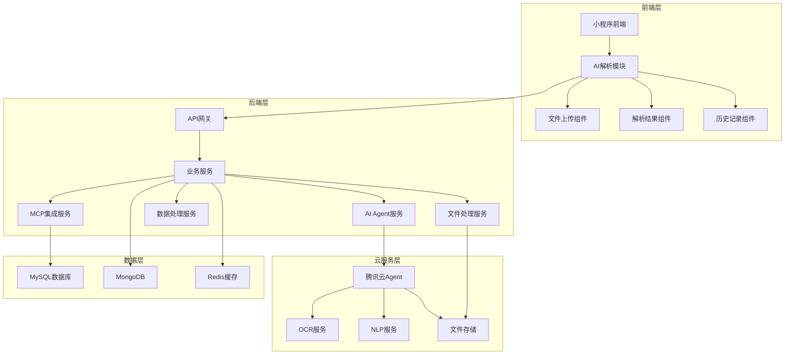

# AI病历解析功能详细技术设计方案

## 1. 技术架构概述

### 1.1 整体架构



### 1.2 技术栈选择

| 层次 | 技术/框架 | 版本 | 选型理由 |
|------|-----------|------|----------|
| 前端 | Taro | 4.1.5 | 跨平台小程序开发框架，支持微信小程序等多个平台 |
| 前端 | React | 18.0.0 | 组件化开发，性能优异 |
| 前端 | Sass | 最新版 | 强大的CSS预处理器，提高样式开发效率 |
| 后端 | Java | 17 | 成熟稳定，适合企业级应用，生态丰富 |
| 后端 | Spring Boot | 3.2.x | 快速开发框架，内置Tomcat等容器 |
| 后端 | Spring Cloud | 2023.x | 微服务架构框架，提供服务注册发现等能力 |
| 后端 | MyBatis-Plus | 3.5.x | 增强版MyBatis，简化数据库操作 |
| 后端 | MongoDB Java Driver | 4.10.x | MongoDB官方Java驱动 |
| 后端 | Redis Client | Lettuce 6.x | 高性能Redis客户端 |
| 云服务 | 腾讯云Agent | 最新版 | 提供强大的AI能力，包括OCR、NLP等 |
| 云服务 | 腾讯云COS | 最新版 | 安全可靠的对象存储服务 |
| 云服务 | 腾讯云OCR | 最新版 | 高精度的文字识别服务 |
| 云服务 | 腾讯云NLP | 最新版 | 强大的自然语言处理服务 |

## 2. 前端详细设计

### 2.1 页面结构

| 页面 | 路径 | 主要功能 | 组件 |
|------|------|----------|------|
| AI解析主页 | `src/pages/aiParse/index.jsx` | 功能介绍、入口导航 | FileUploader, ParseHistory |
| 文件上传页面 | `src/pages/aiParse/upload.jsx` | 文件选择、上传、预览 | FileUploader, ProgressBar |
| 解析结果页面 | `src/pages/aiParse/result.jsx` | 结果展示、编辑、确认 | DataPreview, EventEditor |
| 历史记录页面 | `src/pages/aiParse/history.jsx` | 历史任务列表、详情查看 | ParseHistoryList, HistoryDetail |
| 时间轴页面 | `src/pages/timeline/timeline.jsx` | 添加AI解析入口 | AIParseEntry |

### 2.2 核心组件设计

#### 2.2.1 FileUploader组件

**功能**：文件选择、上传、预览、进度显示

**参数**：
- `maxFiles`: 最大文件数量，默认5
- `maxSize`: 最大文件大小，默认20MB
- `accept`: 支持的文件类型
- `onUploadComplete`: 上传完成回调

**实现**：
```jsx
// src/components/FileUploader/index.jsx
import { Button, View, Text, Progress } from '@tarojs/components';
import Taro from '@tarojs/taro';
import { useState } from 'react';
import { upload } from '@/utils/request';
import './index.scss';

const FileUploader = ({ maxFiles = 5, maxSize = 20 * 1024 * 1024, accept, onUploadComplete }) => {
  const [files, setFiles] = useState([]);
  const [uploading, setUploading] = useState(false);
  const [progress, setProgress] = useState(0);

  const handleChooseFile = async () => {
    if (files.length >= maxFiles) {
      Taro.showToast({ title: `最多只能上传${maxFiles}个文件`, icon: 'none' });
      return;
    }

    try {
      const res = await Taro.chooseMessageFile({
        count: maxFiles - files.length,
        type: 'all',
        extension: accept || ['.pdf', '.doc', '.docx', '.jpg', '.jpeg', '.png'],
      });

      const newFiles = res.tempFiles.map(file => {
        if (file.size > maxSize) {
          Taro.showToast({ title: `文件大小不能超过${maxSize / (1024 * 1024)}MB`, icon: 'none' });
          return null;
        }
        return {
          id: `temp_${Date.now()}_${Math.random().toString(36).substr(2, 9)}`,
          name: file.name,
          path: file.path,
          size: file.size,
          type: file.type || getFileType(file.name),
          status: 'pending'
        };
      }).filter(Boolean);

      setFiles([...files, ...newFiles]);
    } catch (error) {
      console.error('选择文件失败:', error);
      Taro.showToast({ title: '选择文件失败', icon: 'none' });
    }
  };

  const handleUpload = async () => {
    if (files.length === 0) {
      Taro.showToast({ title: '请先选择文件', icon: 'none' });
      return;
    }

    setUploading(true);
    setProgress(0);

    try {
      const uploadedFiles = [];
      const totalFiles = files.length;

      for (let i = 0; i < totalFiles; i++) {
        const file = files[i];
        setFiles(prev => prev.map(f => f.id === file.id ? { ...f, status: 'uploading' } : f));

        const uploadResult = await upload('/api/ai/upload', file.path, {
          objKey: file.name,
          path: '/ai-parse/',
          onProgress: (p) => {
            const currentProgress = Math.round(((i + p / 100) / totalFiles) * 100);
            setProgress(currentProgress);
          }
        });

        const parsedResult = typeof uploadResult.data === 'object' ? uploadResult.data : JSON.parse(uploadResult.data);
        const uploadedFile = {
          ...file,
          status: 'uploaded',
          url: parsedResult.data.objKeyUrl
        };
        uploadedFiles.push(uploadedFile);
        setFiles(prev => prev.map(f => f.id === file.id ? uploadedFile : f));
      }

      setUploading(false);
      setProgress(0);
      Taro.showToast({ title: '文件上传成功', icon: 'success' });
      if (onUploadComplete) {
        onUploadComplete(uploadedFiles);
      }
    } catch (error) {
      console.error('上传失败:', error);
      setUploading(false);
      setProgress(0);
      Taro.showToast({ title: '上传失败', icon: 'none' });
    }
  };

  const getFileType = (fileName) => {
    const ext = fileName.split('.').pop().toLowerCase();
    if (['jpg', 'jpeg', 'png'].includes(ext)) return 'image';
    if (['pdf'].includes(ext)) return 'pdf';
    if (['doc', 'docx'].includes(ext)) return 'word';
    return 'other';
  };

  const formatFileSize = (size) => {
    if (size < 1024) return `${size}B`;
    if (size < 1024 * 1024) return `${(size / 1024).toFixed(1)}KB`;
    return `${(size / (1024 * 1024)).toFixed(1)}MB`;
  };

  return (
    <View className="file-uploader">
      <Button className="choose-btn" onClick={handleChooseFile} disabled={uploading || files.length >= maxFiles}>
        选择文件
      </Button>
      
      {files.length > 0 && (
        <View className="file-list">
          {files.map(file => (
            <View key={file.id} className="file-item">
              <Text className="file-icon">
                {file.type === 'pdf' ? '📄' : file.type === 'word' ? '📝' : file.type === 'image' ? '🖼️' : '📦'}
              </Text>
              <View className="file-info">
                <Text className="file-name">{file.name}</Text>
                <Text className="file-size">{formatFileSize(file.size)}</Text>
              </View>
              <Text className={`file-status ${file.status}`}>
                {file.status === 'pending' ? '待上传' : file.status === 'uploading' ? '上传中' : '已上传'}
              </Text>
            </View>
          ))}
        </View>
      )}

      {uploading && (
        <View className="upload-progress">
          <Progress percent={progress} showInfo strokeWidth={2} />
          <Text className="progress-text">上传中...</Text>
        </View>
      )}

      {files.length > 0 && files.every(f => f.status === 'uploaded') && (
        <Button className="upload-btn" onClick={handleUpload} disabled={uploading}>
          开始上传
        </Button>
      )}
    </View>
  );
};

export default FileUploader;
```

#### 2.2.2 解析结果组件

**功能**：展示AI解析结果，支持编辑和确认

**实现**：
```jsx
// src/components/DataPreview/index.jsx
import { View, Text, Button, Input, Textarea, Picker } from '@tarojs/components';
import { useState } from 'react';
import './index.scss';

const DataPreview = ({ parseResult, onConfirm }) => {
  const [editedResult, setEditedResult] = useState(parseResult);
  const [selectedEvents, setSelectedEvents] = useState(parseResult.events.map(e => e.eventId));

  const handleEditField = (eventIndex, field, value) => {
    const newEvents = [...editedResult.events];
    newEvents[eventIndex] = {
      ...newEvents[eventIndex],
      [field]: value
    };
    setEditedResult({
      ...editedResult,
      events: newEvents
    });
  };

  const handleToggleSelect = (eventId) => {
    setSelectedEvents(prev => {
      if (prev.includes(eventId)) {
        return prev.filter(id => id !== eventId);
      } else {
        return [...prev, eventId];
      }
    });
  };

  const handleSelectAll = () => {
    if (selectedEvents.length === editedResult.events.length) {
      setSelectedEvents([]);
    } else {
      setSelectedEvents(editedResult.events.map(e => e.eventId));
    }
  };

  const handleConfirm = () => {
    const eventsToImport = editedResult.events.filter(e => selectedEvents.includes(e.eventId));
    if (onConfirm) {
      onConfirm(eventsToImport);
    }
  };

  const eventTypeOptions = [
    { label: '治疗小结', value: 'treatment' },
    { label: '检查事件', value: 'inspection' },
    { label: '用药事件', value: 'medication' }
  ];

  return (
    <View className="data-preview">
      {/* 患者信息 */}
      <View className="section">
        <Text className="section-title">患者信息</Text>
        <View className="info-item">
          <Text className="info-label">姓名：</Text>
          <Input
            value={editedResult.patientInfo.name}
            onChange={(e) => handleEditField(0, 'patientInfo.name', e.detail.value)}
            className="info-input"
          />
        </View>
        <View className="info-item">
          <Text className="info-label">性别：</Text>
          <Input
            value={editedResult.patientInfo.gender}
            onChange={(e) => handleEditField(0, 'patientInfo.gender', e.detail.value)}
            className="info-input"
          />
        </View>
        <View className="info-item">
          <Text className="info-label">年龄：</Text>
          <Input
            value={editedResult.patientInfo.age}
            onChange={(e) => handleEditField(0, 'patientInfo.age', parseInt(e.detail.value) || '')}
            className="info-input"
            type="number"
          />
        </View>
      </View>

      {/* 事件列表 */}
      <View className="section">
        <Text className="section-title">事件列表</Text>
        {editedResult.events.map((event, index) => (
          <View key={event.eventId} className="event-card">
            <View className="event-header">
              <Button
                className={`select-btn ${selectedEvents.includes(event.eventId) ? 'selected' : ''}`}
                onClick={() => handleToggleSelect(event.eventId)}
              >
                {selectedEvents.includes(event.eventId) ? '✓' : ''}
              </Button>
              <Text className="event-type">
                {eventTypeOptions.find(opt => opt.value === event.eventType)?.label}
              </Text>
              <Text className="confidence">置信度：{event.confidence}%</Text>
            </View>

            <View className="event-detail">
              <View className="detail-item">
                <Text className="detail-label">事件日期：</Text>
                <Input
                  value={event.eventDate}
                  onChange={(e) => handleEditField(index, 'eventDate', e.detail.value)}
                  className="detail-input"
                />
              </View>
              <View className="detail-item">
                <Text className="detail-label">标题：</Text>
                <Input
                  value={event.title}
                  onChange={(e) => handleEditField(index, 'title', e.detail.value)}
                  className="detail-input"
                />
              </View>
              <View className="detail-item">
                <Text className="detail-label">医院：</Text>
                <Input
                  value={event.hospitalName}
                  onChange={(e) => handleEditField(index, 'hospitalName', e.detail.value)}
                  className="detail-input"
                />
              </View>
              <View className="detail-item">
                <Text className="detail-label">医生：</Text>
                <Input
                  value={event.doctorName}
                  onChange={(e) => handleEditField(index, 'doctorName', e.detail.value)}
                  className="detail-input"
                />
              </View>
              <View className="detail-item">
                <Text className="detail-label">诊断结果：</Text>
                <Textarea
                  value={event.diagnosisResult}
                  onChange={(e) => handleEditField(index, 'diagnosisResult', e.detail.value)}
                  className="detail-textarea"
                />
              </View>
              <View className="detail-item">
                <Text className="detail-label">治疗方案：</Text>
                <Textarea
                  value={event.treatmentPlan}
                  onChange={(e) => handleEditField(index, 'treatmentPlan', e.detail.value)}
                  className="detail-textarea"
                />
              </View>
            </View>
          </View>
        ))}
      </View>

      {/* 操作按钮 */}
      <View className="action-buttons">
        <Button className="select-all-btn" onClick={handleSelectAll}>
          {selectedEvents.length === editedResult.events.length ? '取消全选' : '全选'}
        </Button>
        <Button className="confirm-btn" onClick={handleConfirm} disabled={selectedEvents.length === 0}>
          确认录入 ({selectedEvents.length}/{editedResult.events.length})
        </Button>
      </View>
    </View>
  );
};

export default DataPreview;
```

### 2.3 前端页面实现

#### 2.3.1 AI解析主页

**功能**：功能介绍、上传入口、历史记录入口

**实现**：
```jsx
// src/pages/aiParse/index.jsx
import { Button, Text, View, ScrollView } from '@tarojs/components';
import Taro, { useRouter } from '@tarojs/taro';
import './index.scss';

const AiParse = () => {
  const router = useRouter();
  const patientId = router.params.patientId;

  const handleUpload = () => {
    Taro.navigateTo({
      url: `/pages/aiParse/upload?patientId=${patientId}`
    });
  };

  const handleHistory = () => {
    Taro.navigateTo({
      url: `/pages/aiParse/history?patientId=${patientId}`
    });
  };

  return (
    <View className='ai-parse-container'>
      <ScrollView className='content' scrollY>
        <View className='intro-section'>
          <Text className='intro-title'>AI病历解析</Text>
          <Text className='intro-desc'>
            上传病历文件，AI将自动提取关键信息并生成治疗事件，
            减少手动录入的工作量，提高数据准确性。
          </Text>
          <View className='feature-list'>
            <View className='feature-item'>
              <Text className='feature-icon'>📁</Text>
              <Text className='feature-text'>支持PDF、Word、图片等多种格式</Text>
            </View>
            <View className='feature-item'>
              <Text className='feature-icon'>🤖</Text>
              <Text className='feature-text'>AI自动提取关键医疗信息</Text>
            </View>
            <View className='feature-item'>
              <Text className='feature-icon'>✏️</Text>
              <Text className='feature-text'>支持手动编辑和确认</Text>
            </View>
            <View className='feature-item'>
              <Text className='feature-icon'>📊</Text>
              <Text className='feature-text'>自动生成治疗事件时间轴</Text>
            </View>
          </View>
        </View>

        <View className='action-section'>
          <Button className='primary-btn' onClick={handleUpload}>
            <Text className='btn-icon'>📤</Text>
            <Text className='btn-text'>上传病历文件</Text>
          </Button>
          <Button className='secondary-btn' onClick={handleHistory}>
            <Text className='btn-icon'>📋</Text>
            <Text className='btn-text'>查看解析历史</Text>
          </Button>
        </View>

        <View className='notice-section'>
          <Text className='notice-title'>温馨提示</Text>
          <View className='notice-list'>
            <View className='notice-item'>
              <Text className='notice-dot'>•</Text>
              <Text className='notice-text'>请确保上传的病历文件清晰可辨</Text>
            </View>
            <View className='notice-item'>
              <Text className='notice-dot'>•</Text>
              <Text className='notice-text'>单次最多上传5个文件，每个文件不超过20MB</Text>
            </View>
            <View className='notice-item'>
              <Text className='notice-dot'>•</Text>
              <Text className='notice-text'>AI解析结果仅供参考，请仔细核对后确认</Text>
            </View>
            <View className='notice-item'>
              <Text className='notice-dot'>•</Text>
              <Text className='notice-text'>解析过程可能需要几分钟时间，请耐心等待</Text>
            </View>
          </View>
        </View>
      </ScrollView>
    </View>
  );
};

export default AiParse;
```

#### 2.3.2 文件上传页面

**功能**：文件选择、上传、提交解析

**实现**：
```jsx
// src/pages/aiParse/upload.jsx
import { Button, Text, View, ScrollView, Progress } from '@tarojs/components';
import Taro, { useRouter } from '@tarojs/taro';
import { useState } from 'react';
import FileUploader from '@/components/FileUploader/index';
import './upload.scss';

const Upload = () => {
  const router = useRouter();
  const patientId = router.params.patientId;

  const [files, setFiles] = useState([]);
  const [parseLoading, setParseLoading] = useState(false);

  const handleUploadComplete = (uploadedFiles) => {
    setFiles(uploadedFiles);
  };

  const handleStartParse = async () => {
    if (files.length === 0) {
      Taro.showToast({ title: '请先上传文件', icon: 'none' });
      return;
    }

    setParseLoading(true);

    try {
      const uploadFiles = files.map(file => ({
        fileName: file.name,
        filePath: file.url,
        fileType: file.type,
        fileSize: file.size
      }));

      const response = await Taro.request({
        url: '/api/ai/parse',
        method: 'POST',
        data: {
          patientId,
          files: uploadFiles
        }
      });

      if (response.statusCode === 200 && response.data.code === 0) {
        const parseId = response.data.data.parseId;
        Taro.showToast({ title: '解析任务已提交', icon: 'success' });
        
        Taro.navigateTo({
          url: `/pages/aiParse/result?parseId=${parseId}&patientId=${patientId}`
        });
      } else {
        Taro.showToast({ title: response.data.msg || '解析任务提交失败', icon: 'none' });
      }
    } catch (error) {
      console.error('解析任务提交失败:', error);
      Taro.showToast({ title: '解析任务提交失败', icon: 'none' });
    } finally {
      setParseLoading(false);
    }
  };

  return (
    <View className='upload-container'>
      <ScrollView className='content' scrollY>
        <View className='upload-section'>
          <Text className='section-title'>上传文件</Text>
          <Text className='section-desc'>
            支持PDF、Word、图片等格式，单个文件不超过20MB
          </Text>
          
          <FileUploader
            maxFiles={5}
            maxSize={20 * 1024 * 1024}
            onUploadComplete={handleUploadComplete}
          />
        </View>

        <View className='action-section'>
          <Button 
            className='parse-btn' 
            onClick={handleStartParse}
            disabled={parseLoading || files.length === 0}
          >
            {parseLoading ? '提交中...' : '开始解析'}
          </Button>
        </View>
      </ScrollView>
    </View>
  );
};

export default Upload;
```

#### 2.3.3 解析结果页面

**功能**：显示解析结果、编辑、确认录入

**实现**：
```jsx
// src/pages/aiParse/result.jsx
import { Button, Text, View, ScrollView, ActivityIndicator } from '@tarojs/components';
import Taro, { useRouter, useDidShow } from '@tarojs/taro';
import { useState, useEffect } from 'react';
import DataPreview from '@/components/DataPreview/index';
import './result.scss';

const Result = () => {
  const router = useRouter();
  const parseId = router.params.parseId;
  const patientId = router.params.patientId;

  const [parseResult, setParseResult] = useState(null);
  const [loading, setLoading] = useState(true);
  const [importing, setImporting] = useState(false);
  const [progress, setProgress] = useState(0);

  const fetchParseResult = async () => {
    try {
      const response = await Taro.request({
        url: `/api/ai/parse/status?parseId=${parseId}`,
        method: 'GET'
      });

      if (response.statusCode === 200 && response.data.code === 0) {
        const data = response.data.data;
        if (data.status === 'success') {
          setParseResult(data.result);
          setLoading(false);
        } else if (data.status === 'failed') {
          Taro.showToast({ title: data.errorMessage || '解析失败', icon: 'none' });
          setLoading(false);
        } else {
          // 解析中，继续轮询
          setProgress(data.progress || 0);
          setTimeout(fetchParseResult, 3000);
        }
      } else {
        Taro.showToast({ title: '获取解析结果失败', icon: 'none' });
        setLoading(false);
      }
    } catch (error) {
      console.error('获取解析结果失败:', error);
      Taro.showToast({ title: '获取解析结果失败', icon: 'none' });
      setLoading(false);
    }
  };

  const handleConfirmImport = async (eventsToImport) => {
    setImporting(true);

    try {
      const response = await Taro.request({
        url: '/api/ai/import',
        method: 'POST',
        data: {
          parseId,
          events: eventsToImport,
          patientId
        }
      });

      if (response.statusCode === 200 && response.data.code === 0) {
        const importedEvents = response.data.data.importedEvents;
        const failedEvents = response.data.data.failedEvents || [];

        Taro.showToast({ 
          title: `成功录入 ${importedEvents.length} 个事件`, 
          icon: 'success' 
        });

        if (failedEvents.length > 0) {
          Taro.showToast({ 
            title: `有 ${failedEvents.length} 个事件录入失败`, 
            icon: 'none' 
          });
        }

        // 返回时间轴页面
        Taro.navigateTo({
          url: `/pages/timeline/timeline?patientId=${patientId}`
        });
      } else {
        Taro.showToast({ title: '录入失败', icon: 'none' });
      }
    } catch (error) {
      console.error('录入失败:', error);
      Taro.showToast({ title: '录入失败', icon: 'none' });
    } finally {
      setImporting(false);
    }
  };

  useEffect(() => {
    fetchParseResult();
  }, [parseId]);

  if (loading) {
    return (
      <View className='loading-container'>
        <ActivityIndicator size='large' color='#1890ff' />
        <Text className='loading-text'>正在解析，请稍候...</Text>
        {progress > 0 && (
          <View className='progress-container'>
            <Text className='progress-text'>解析进度：{progress}%</Text>
          </View>
        )}
      </View>
    );
  }

  if (!parseResult) {
    return (
      <View className='error-container'>
        <Text className='error-text'>解析失败，请重试</Text>
        <Button className='retry-btn' onClick={() => Taro.navigateBack()}>
          返回
        </Button>
      </View>
    );
  }

  return (
    <View className='result-container'>
      <ScrollView className='content' scrollY>
        <DataPreview 
          parseResult={parseResult} 
          onConfirm={handleConfirmImport} 
        />
      </ScrollView>
    </View>
  );
};

export default Result;
```

## 3. 后端详细设计

### 3.1 API接口设计

| 接口路径 | 方法 | 模块 | 功能描述 | 请求体 (JSON) | 成功响应 (200 OK) |
|---------|------|------|----------|--------------|------------------|
| `/api/ai/upload` | POST | 文件处理 | 上传病历文件 | `multipart/form-data` | `{"code": 0, "data": {"uploadId": "...", "files": [...]}, "msg": "上传成功"}` |
| `/api/ai/parse` | POST | AI解析 | 提交解析任务 | `{"patientId": "...", "files": [...]}` | `{"code": 0, "data": {"parseId": "...", "status": "processing"}, "msg": "解析任务已提交"}` |
| `/api/ai/parse/status` | GET | AI解析 | 查询解析状态 | N/A (query: parseId) | `{"code": 0, "data": {"status": "success", "result": {...}}, "msg": "查询成功"}` |
| `/api/ai/import` | POST | 数据处理 | 录入解析结果 | `{"parseId": "...", "events": [...], "patientId": "..."}` | `{"code": 0, "data": {"importedEvents": [...]}, "msg": "录入成功"}` |
| `/api/ai/history` | GET | 历史记录 | 查询解析历史 | N/A (query: patientId, page, pageSize) | `{"code": 0, "data": {"list": [...], "total": 10}, "msg": "查询成功"}` |
| `/api/ai/history/detail` | GET | 历史记录 | 查询历史详情 | N/A (query: parseId) | `{"code": 0, "data": {...}, "msg": "查询成功"}` |

### 3.2 核心服务设计

#### 3.2.1 文件处理服务

**功能**：处理文件上传、存储和管理

**实现**：
```java
// src/main/java/com/medical/chaperon/service/FileService.java
package com.medical.chaperon.service;

import com.qcloud.cos.COSClient;
import com.qcloud.cos.ClientConfig;
import com.qcloud.cos.auth.BasicCOSCredentials;
import com.qcloud.cos.auth.COSCredentials;
import com.qcloud.cos.exception.CosClientException;
import com.qcloud.cos.exception.CosServiceException;
import com.qcloud.cos.http.HttpProtocol;
import com.qcloud.cos.model.ObjectMetadata;
import com.qcloud.cos.model.PutObjectRequest;
import com.qcloud.cos.model.PutObjectResult;
import com.qcloud.cos.region.Region;
import org.springframework.beans.factory.annotation.Value;
import org.springframework.stereotype.Service;
import org.springframework.web.multipart.MultipartFile;

import java.io.IOException;
import java.io.InputStream;
import java.util.UUID;

@Service
public class FileService {

    @Value("${tencent.cloud.secret-id}")
    private String secretId;

    @Value("${tencent.cloud.secret-key}")
    private String secretKey;

    @Value("${tencent.cloud.cos.bucket}")
    private String bucketName;

    @Value("${tencent.cloud.cos.region}")
    private String regionName;

    private COSClient cosClient;

    // 初始化COS客户端
    private COSClient getCosClient() {
        if (cosClient == null) {
            COSCredentials cred = new BasicCOSCredentials(secretId, secretKey);
            Region region = new Region(regionName);
            ClientConfig clientConfig = new ClientConfig(region);
            clientConfig.setHttpProtocol(HttpProtocol.https);
            cosClient = new COSClient(cred, clientConfig);
        }
        return cosClient;
    }

    // 上传文件
    public FileUploadResult uploadFile(MultipartFile file, String folder) throws IOException {
        String originalFilename = file.getOriginalFilename();
        String fileName = UUID.randomUUID().toString() + "_" + originalFilename;
        String key = folder + fileName;

        // 获取文件输入流
        InputStream inputStream = file.getInputStream();
        ObjectMetadata objectMetadata = new ObjectMetadata();
        objectMetadata.setContentLength(file.getSize());

        // 创建上传请求
        PutObjectRequest putObjectRequest = new PutObjectRequest(
                bucketName, key, inputStream, objectMetadata);

        // 执行上传
        PutObjectResult putObjectResult = getCosClient().putObject(putObjectRequest);

        // 构建文件URL
        String fileUrl = String.format("https://%s.cos.%s.myqcloud.com/%s", 
                bucketName, regionName, key);

        // 关闭输入流
        inputStream.close();

        return new FileUploadResult(key, fileUrl, putObjectResult.getETag());
    }

    // 获取文件URL
    public String getFileUrl(String key) {
        return String.format("https://%s.cos.%s.myqcloud.com/%s", 
                bucketName, regionName, key);
    }

    // 删除文件
    public void deleteFile(String key) {
        try {
            getCosClient().deleteObject(bucketName, key);
        } catch (CosServiceException | CosClientException e) {
            e.printStackTrace();
            throw new RuntimeException("删除文件失败", e);
        }
    }

    // 上传结果类
    public static class FileUploadResult {
        private final String key;
        private final String url;
        private final String etag;

        public FileUploadResult(String key, String url, String etag) {
            this.key = key;
            this.url = url;
            this.etag = etag;
        }

        public String getKey() {
            return key;
        }

        public String getUrl() {
            return url;
        }

        public String getEtag() {
            return etag;
        }
    }
}
```

#### 3.2.2 AI Agent服务

**功能**：对接腾讯云Agent，处理文件解析和信息提取

**实现**：
```java
// src/main/java/com/medical/chaperon/service/AiAgentService.java
package com.medical.chaperon.service;

import com.fasterxml.jackson.databind.ObjectMapper;
import org.springframework.beans.factory.annotation.Value;
import org.springframework.stereotype.Service;
import org.springframework.web.client.RestTemplate;
import org.springframework.http.HttpEntity;
import org.springframework.http.HttpHeaders;
import org.springframework.http.HttpMethod;
import org.springframework.http.ResponseEntity;

import java.util.List;
import java.util.Map;

@Service
public class AiAgentService {

    @Value("${tencent.agent.url}")
    private String agentUrl;

    @Value("${tencent.agent.api-key}")
    private String apiKey;

    @Value("${tencent.agent.app-id}")
    private String appId;

    private final RestTemplate restTemplate;
    private final ObjectMapper objectMapper;

    public AiAgentService() {
        this.restTemplate = new RestTemplate();
        this.objectMapper = new ObjectMapper();
    }

    // 解析病历文件
    public ParseResult parseMedicalRecord(List<FileInfo> files) {
        try {
            // 构建请求头
            HttpHeaders headers = new HttpHeaders();
            headers.setContentType(org.springframework.http.MediaType.APPLICATION_JSON);
            headers.set("X-Api-Key", apiKey);
            headers.set("X-App-Id", appId);

            // 构建请求体
            Map<String, Object> requestBody = Map.of(
                    "files", files.stream().map(file -> Map.of(
                            "url", file.getFilePath(),
                            "type", file.getFileType(),
                            "name", file.getFileName()
                    )).toList(),
                    "patientId", files.get(0).getPatientId()
            );

            // 创建请求实体
            HttpEntity<Map<String, Object>> requestEntity = new HttpEntity<>(requestBody, headers);

            // 发送请求
            ResponseEntity<ParseResult> response = restTemplate.exchange(
                    agentUrl + "/parse-medical-record",
                    HttpMethod.POST,
                    requestEntity,
                    ParseResult.class
            );

            return response.getBody();
        } catch (Exception e) {
            e.printStackTrace();
            throw new RuntimeException("AI解析失败", e);
        }
    }

    // 获取解析状态
    public ParseStatus getParseStatus(String taskId) {
        try {
            // 构建请求头
            HttpHeaders headers = new HttpHeaders();
            headers.set("X-Api-Key", apiKey);
            headers.set("X-App-Id", appId);

            // 创建请求实体
            HttpEntity<?> requestEntity = new HttpEntity<>(headers);

            // 发送请求
            ResponseEntity<ParseStatus> response = restTemplate.exchange(
                    agentUrl + "/parse-status?taskId=" + taskId,
                    HttpMethod.GET,
                    requestEntity,
                    ParseStatus.class
            );

            return response.getBody();
        } catch (Exception e) {
            e.printStackTrace();
            throw new RuntimeException("查询解析状态失败", e);
        }
    }

    // 内部类：文件信息
    public static class FileInfo {
        private String filePath;
        private String fileType;
        private String fileName;
        private String patientId;

        // getters and setters
        public String getFilePath() { return filePath; }
        public void setFilePath(String filePath) { this.filePath = filePath; }
        public String getFileType() { return fileType; }
        public void setFileType(String fileType) { this.fileType = fileType; }
        public String getFileName() { return fileName; }
        public void setFileName(String fileName) { this.fileName = fileName; }
        public String getPatientId() { return patientId; }
        public void setPatientId(String patientId) { this.patientId = patientId; }
    }

    // 内部类：解析结果
    public static class ParseResult {
        private String taskId;
        private String status;
        private String message;

        // getters and setters
        public String getTaskId() { return taskId; }
        public void setTaskId(String taskId) { this.taskId = taskId; }
        public String getStatus() { return status; }
        public void setStatus(String status) { this.status = status; }
        public String getMessage() { return message; }
        public void setMessage(String message) { this.message = message; }
    }

    // 内部类：解析状态
    public static class ParseStatus {
        private String taskId;
        private String status;
        private int progress;
        private Object result;
        private String error;

        // getters and setters
        public String getTaskId() { return taskId; }
        public void setTaskId(String taskId) { this.taskId = taskId; }
        public String getStatus() { return status; }
        public void setStatus(String status) { this.status = status; }
        public int getProgress() { return progress; }
        public void setProgress(int progress) { this.progress = progress; }
        public Object getResult() { return result; }
        public void setResult(Object result) { this.result = result; }
        public String getError() { return error; }
        public void setError(String error) { this.error = error; }
    }
}
```

#### 3.2.3 数据处理服务

**功能**：处理解析结果，生成事件数据

**实现**：
```java
// src/main/java/com/medical/chaperon/service/DataProcessingService.java
package com.medical.chaperon.service;

import com.fasterxml.jackson.core.JsonProcessingException;
import com.fasterxml.jackson.databind.ObjectMapper;
import com.medical.chaperon.entity.ParseTask;
import com.medical.chaperon.repository.ParseTaskRepository;
import org.springframework.beans.factory.annotation.Autowired;
import org.springframework.stereotype.Service;

import java.util.Date;
import java.util.List;
import java.util.Map;

@Service
public class DataProcessingService {

    @Autowired
    private ParseTaskRepository parseTaskRepository;

    private final ObjectMapper objectMapper;

    public DataProcessingService() {
        this.objectMapper = new ObjectMapper();
    }

    // 保存解析任务
    public ParseTask saveParseTask(ParseTask taskData) {
        taskData.setCreatedAt(new Date());
        taskData.setUpdatedAt(new Date());
        return parseTaskRepository.save(taskData);
    }

    // 更新解析任务
    public ParseTask updateParseTask(String parseId, Map<String, Object> updateData) {
        ParseTask task = parseTaskRepository.findByParseId(parseId);
        if (task != null) {
            // 更新字段
            if (updateData.containsKey("status")) {
                task.setStatus((String) updateData.get("status"));
            }
            if (updateData.containsKey("progress")) {
                task.setProgress((Integer) updateData.get("progress"));
            }
            if (updateData.containsKey("result")) {
                task.setResult(updateData.get("result"));
            }
            if (updateData.containsKey("errorMessage")) {
                task.setErrorMessage((String) updateData.get("errorMessage"));
            }
            task.setUpdatedAt(new Date());
            return parseTaskRepository.save(task);
        }
        return null;
    }

    // 获取解析任务
    public ParseTask getParseTask(String parseId) {
        return parseTaskRepository.findByParseId(parseId);
    }

    // 生成事件数据
    public List<EventData> generateEventData(List<MedicalEvent> events, String patientId) throws JsonProcessingException {
        return events.stream().map(event -> {
            try {
                Map<String, Object> content = Map.of();
                
                switch (event.getEventType()) {
                    case "treatment":
                        content = Map.of(
                                "hospital_name", event.getHospitalName(),
                                "doctor_name", event.getDoctorName(),
                                "diagnosis_result", event.getDiagnosisResult(),
                                "treatment_plan", event.getTreatmentPlan()
                        );
                        break;
                    case "inspection":
                        content = Map.of(
                                "hospital_name", event.getHospitalName(),
                                "doctor_name", event.getDoctorName(),
                                "inspection_items", event.getInspectionItems()
                        );
                        break;
                    case "medication":
                        content = Map.of(
                                "hospital_name", event.getHospitalName(),
                                "doctor_name", event.getDoctorName(),
                                "medications", event.getMedications()
                        );
                        break;
                }

                return new EventData(
                        patientId,
                        event.getEventDate(),
                        event.getEventType(),
                        event.getTitle(),
                        objectMapper.writeValueAsString(content),
                        event.isKeyNode() ? 1 : 0,
                        event.getSourceFiles()
                );
            } catch (JsonProcessingException e) {
                e.printStackTrace();
                throw new RuntimeException("生成事件数据失败", e);
            }
        }).toList();
    }

    // 内部类：医疗事件
    public static class MedicalEvent {
        private String eventType;
        private String hospitalName;
        private String doctorName;
        private String diagnosisResult;
        private String treatmentPlan;
        private String inspectionItems;
        private String medications;
        private String eventDate;
        private String title;
        private boolean keyNode;
        private List<String> sourceFiles;

        // getters and setters
        public String getEventType() { return eventType; }
        public void setEventType(String eventType) { this.eventType = eventType; }
        public String getHospitalName() { return hospitalName; }
        public void setHospitalName(String hospitalName) { this.hospitalName = hospitalName; }
        public String getDoctorName() { return doctorName; }
        public void setDoctorName(String doctorName) { this.doctorName = doctorName; }
        public String getDiagnosisResult() { return diagnosisResult; }
        public void setDiagnosisResult(String diagnosisResult) { this.diagnosisResult = diagnosisResult; }
        public String getTreatmentPlan() { return treatmentPlan; }
        public void setTreatmentPlan(String treatmentPlan) { this.treatmentPlan = treatmentPlan; }
        public String getInspectionItems() { return inspectionItems; }
        public void setInspectionItems(String inspectionItems) { this.inspectionItems = inspectionItems; }
        public String getMedications() { return medications; }
        public void setMedications(String medications) { this.medications = medications; }
        public String getEventDate() { return eventDate; }
        public void setEventDate(String eventDate) { this.eventDate = eventDate; }
        public String getTitle() { return title; }
        public void setTitle(String title) { this.title = title; }
        public boolean isKeyNode() { return keyNode; }
        public void setKeyNode(boolean keyNode) { this.keyNode = keyNode; }
        public List<String> getSourceFiles() { return sourceFiles; }
        public void setSourceFiles(List<String> sourceFiles) { this.sourceFiles = sourceFiles; }
    }

    // 内部类：事件数据
    public static class EventData {
        private String patientId;
        private String eventDate;
        private String eventType;
        private String title;
        private String content;
        private int isKeyNode;
        private List<String> attachments;

        // constructor
        public EventData(String patientId, String eventDate, String eventType, 
                        String title, String content, int isKeyNode, 
                        List<String> attachments) {
            this.patientId = patientId;
            this.eventDate = eventDate;
            this.eventType = eventType;
            this.title = title;
            this.content = content;
            this.isKeyNode = isKeyNode;
            this.attachments = attachments;
        }

        // getters
        public String getPatientId() { return patientId; }
        public String getEventDate() { return eventDate; }
        public String getEventType() { return eventType; }
        public String getTitle() { return title; }
        public String getContent() { return content; }
        public int getIsKeyNode() { return isKeyNode; }
        public List<String> getAttachments() { return attachments; }
    }
}
```

#### 3.2.4 MCP集成服务

**功能**：对接MCP接口，录入事件数据

**实现**：
```java
// src/main/java/com/medical/chaperon/service/McpService.java
package com.medical.chaperon.service;

import org.springframework.beans.factory.annotation.Value;
import org.springframework.stereotype.Service;
import org.springframework.web.client.RestTemplate;
import org.springframework.http.HttpEntity;
import org.springframework.http.HttpHeaders;
import org.springframework.http.HttpMethod;
import org.springframework.http.ResponseEntity;

import java.util.List;
import java.util.Map;

@Service
public class McpService {

    @Value("${mcp.api.url}")
    private String mcpUrl;

    @Value("${mcp.api.token}")
    private String mcpToken;

    private final RestTemplate restTemplate;

    public McpService() {
        this.restTemplate = new RestTemplate();
    }

    // 创建事件
    public McpResponse createEvent(EventData eventData) {
        try {
            // 构建请求头
            HttpHeaders headers = new HttpHeaders();
            headers.setContentType(org.springframework.http.MediaType.APPLICATION_JSON);
            headers.set("Authorization", "Bearer " + mcpToken);

            // 创建请求实体
            HttpEntity<EventData> requestEntity = new HttpEntity<>(eventData, headers);

            // 发送请求
            ResponseEntity<Map> response = restTemplate.exchange(
                    mcpUrl + "/api/timeline/timeline-events",
                    HttpMethod.POST,
                    requestEntity,
                    Map.class
            );

            // 处理响应
            Map<String, Object> responseBody = response.getBody();
            return new McpResponse(
                    responseBody.get("id").toString(),
                    eventData.getEventType(),
                    "success",
                    null
            );
        } catch (Exception e) {
            e.printStackTrace();
            return new McpResponse(
                    null,
                    eventData.getEventType(),
                    "failed",
                    e.getMessage()
            );
        }
    }

    // 批量创建事件
    public List<McpResponse> batchCreateEvents(List<EventData> events) {
        return events.stream().map(this::createEvent).toList();
    }

    // 内部类：事件数据
    public static class EventData {
        private String patientId;
        private String eventDate;
        private String eventType;
        private String title;
        private String content;
        private int isKeyNode;
        private List<String> attachments;

        // getters and setters
        public String getPatientId() { return patientId; }
        public void setPatientId(String patientId) { this.patientId = patientId; }
        public String getEventDate() { return eventDate; }
        public void setEventDate(String eventDate) { this.eventDate = eventDate; }
        public String getEventType() { return eventType; }
        public void setEventType(String eventType) { this.eventType = eventType; }
        public String getTitle() { return title; }
        public void setTitle(String title) { this.title = title; }
        public String getContent() { return content; }
        public void setContent(String content) { this.content = content; }
        public int getIsKeyNode() { return isKeyNode; }
        public void setIsKeyNode(int isKeyNode) { this.isKeyNode = isKeyNode; }
        public List<String> getAttachments() { return attachments; }
        public void setAttachments(List<String> attachments) { this.attachments = attachments; }
    }

    // 内部类：MCP响应
    public static class McpResponse {
        private String eventId;
        private String eventType;
        private String status;
        private String errorMessage;

        // constructor
        public McpResponse(String eventId, String eventType, String status, String errorMessage) {
            this.eventId = eventId;
            this.eventType = eventType;
            this.status = status;
            this.errorMessage = errorMessage;
        }

        // getters
        public String getEventId() { return eventId; }
        public String getEventType() { return eventType; }
        public String getStatus() { return status; }
        public String getErrorMessage() { return errorMessage; }
    }
}
```

### 3.3 业务逻辑实现

#### 3.3.1 文件上传流程

```java
// src/main/java/com/medical/chaperon/controller/FileController.java
package com.medical.chaperon.controller;

import com.medical.chaperon.service.FileService;
import com.medical.chaperon.service.FileService.FileUploadResult;
import org.springframework.beans.factory.annotation.Autowired;
import org.springframework.http.HttpStatus;
import org.springframework.http.ResponseEntity;
import org.springframework.web.bind.annotation.PostMapping;
import org.springframework.web.bind.annotation.RequestMapping;
import org.springframework.web.bind.annotation.RequestParam;
import org.springframework.web.bind.annotation.RestController;
import org.springframework.web.multipart.MultipartFile;

import java.io.IOException;
import java.util.ArrayList;
import java.util.List;
import java.util.UUID;

@RestController
@RequestMapping("/api/file")
public class FileController {

    @Autowired
    private FileService fileService;

    @PostMapping("/upload")
    public ResponseEntity<UploadResponse> uploadFile(
            @RequestParam("files") MultipartFile[] files,
            @RequestParam("patientId") String patientId) {
        try {
            String uploadId = UUID.randomUUID().toString();
            List<UploadedFile> uploadedFiles = new ArrayList<>();

            for (MultipartFile file : files) {
                String folder = "/ai-parse/" + patientId + "/";
                FileUploadResult uploadResult = fileService.uploadFile(file, folder);

                uploadedFiles.add(new UploadedFile(
                        UUID.randomUUID().toString(),
                        file.getOriginalFilename(),
                        uploadResult.getUrl(),
                        getFileType(file.getOriginalFilename()),
                        file.getSize(),
                        "uploaded"
                ));
            }

            return ResponseEntity.ok(new UploadResponse(
                    0,
                    new UploadData(uploadId, uploadedFiles),
                    "上传成功"
            ));
        } catch (IOException e) {
            e.printStackTrace();
            return ResponseEntity.status(HttpStatus.INTERNAL_SERVER_ERROR)
                    .body(new UploadResponse(500, null, "文件上传失败"));
        }
    }

    private String getFileType(String fileName) {
        String ext = fileName.substring(fileName.lastIndexOf('.') + 1).toLowerCase();
        if (List.of("jpg", "jpeg", "png").contains(ext)) return "image";
        if (List.of("pdf").contains(ext)) return "pdf";
        if (List.of("doc", "docx").contains(ext)) return "word";
        return "other";
    }

    // 内部类：上传响应
    public static class UploadResponse {
        private int code;
        private UploadData data;
        private String msg;

        public UploadResponse(int code, UploadData data, String msg) {
            this.code = code;
            this.data = data;
            this.msg = msg;
        }

        // getters
        public int getCode() { return code; }
        public UploadData getData() { return data; }
        public String getMsg() { return msg; }
    }

    // 内部类：上传数据
    public static class UploadData {
        private String uploadId;
        private List<UploadedFile> files;

        public UploadData(String uploadId, List<UploadedFile> files) {
            this.uploadId = uploadId;
            this.files = files;
        }

        // getters
        public String getUploadId() { return uploadId; }
        public List<UploadedFile> getFiles() { return files; }
    }

    // 内部类：上传文件
    public static class UploadedFile {
        private String id;
        private String fileName;
        private String filePath;
        private String fileType;
        private long fileSize;
        private String status;

        public UploadedFile(String id, String fileName, String filePath, 
                          String fileType, long fileSize, String status) {
            this.id = id;
            this.fileName = fileName;
            this.filePath = filePath;
            this.fileType = fileType;
            this.fileSize = fileSize;
            this.status = status;
        }

        // getters
        public String getId() { return id; }
        public String getFileName() { return fileName; }
        public String getFilePath() { return filePath; }
        public String getFileType() { return fileType; }
        public long getFileSize() { return fileSize; }
        public String getStatus() { return status; }
    }
}
```

#### 3.3.2 AI解析流程

```java
// src/main/java/com/medical/chaperon/controller/AiController.java
package com.medical.chaperon.controller;

import com.medical.chaperon.service.AiAgentService;
import com.medical.chaperon.service.DataProcessingService;
import com.medical.chaperon.entity.ParseTask;
import org.springframework.beans.factory.annotation.Autowired;
import org.springframework.http.HttpStatus;
import org.springframework.http.ResponseEntity;
import org.springframework.web.bind.annotation.*;

import java.util.List;
import java.util.Map;
import java.util.UUID;
import java.util.concurrent.CompletableFuture;

@RestController
@RequestMapping("/api/ai")
public class AiController {

    @Autowired
    private AiAgentService aiAgentService;

    @Autowired
    private DataProcessingService dataProcessingService;

    @PostMapping("/parse")
    public ResponseEntity<ParseResponse> submitParseTask(
            @RequestBody ParseRequest request) {
        try {
            String parseId = UUID.randomUUID().toString();
            String patientId = request.getPatientId();
            List<FileInfo> files = request.getFiles();

            // 创建并保存解析任务
            ParseTask task = new ParseTask();
            task.setParseId(parseId);
            task.setPatientId(patientId);
            task.setFiles(files);
            task.setStatus("processing");
            task.setProgress(0);
            dataProcessingService.saveParseTask(task);

            // 异步处理解析任务
            CompletableFuture.runAsync(() -> {
                processParseTask(parseId, patientId, files);
            });

            return ResponseEntity.ok(new ParseResponse(
                    0,
                    new ParseData(parseId, "processing"),
                    "解析任务已提交"
            ));
        } catch (Exception e) {
            e.printStackTrace();
            return ResponseEntity.status(HttpStatus.INTERNAL_SERVER_ERROR)
                    .body(new ParseResponse(500, null, "提交解析任务失败"));
        }
    }

    private void processParseTask(String parseId, String patientId, List<FileInfo> files) {
        try {
            // 更新进度
            dataProcessingService.updateParseTask(parseId, Map.of(
                    "progress", 20
            ));

            // 转换文件信息格式
            List<AiAgentService.FileInfo> agentFiles = files.stream()
                    .map(file -> {
                        AiAgentService.FileInfo agentFile = new AiAgentService.FileInfo();
                        agentFile.setFilePath(file.getFilePath());
                        agentFile.setFileType(file.getFileType());
                        agentFile.setFileName(file.getFileName());
                        agentFile.setPatientId(patientId);
                        return agentFile;
                    })
                    .toList();

            // 调用AI Agent解析
            AiAgentService.ParseResult parseResult = aiAgentService.parseMedicalRecord(agentFiles);

            // 更新进度
            dataProcessingService.updateParseTask(parseId, Map.of(
                    "progress", 80
            ));

            // 保存解析结果
            dataProcessingService.updateParseTask(parseId, Map.of(
                    "status", "success",
                    "progress", 100,
                    "result", parseResult
            ));
        } catch (Exception e) {
            e.printStackTrace();
            dataProcessingService.updateParseTask(parseId, Map.of(
                    "status", "failed",
                    "errorMessage", e.getMessage()
            ));
        }
    }

    @GetMapping("/status")
    public ResponseEntity<StatusResponse> getParseStatus(
            @RequestParam("parseId") String parseId) {
        try {
            ParseTask task = dataProcessingService.getParseTask(parseId);

            if (task == null) {
                return ResponseEntity.status(HttpStatus.NOT_FOUND)
                        .body(new StatusResponse(404, null, "解析任务不存在"));
            }

            return ResponseEntity.ok(new StatusResponse(
                    0,
                    new StatusData(
                            task.getParseId(),
                            task.getStatus(),
                            task.getProgress(),
                            task.getResult(),
                            task.getErrorMessage()
                    ),
                    "查询成功"
            ));
        } catch (Exception e) {
            e.printStackTrace();
            return ResponseEntity.status(HttpStatus.INTERNAL_SERVER_ERROR)
                    .body(new StatusResponse(500, null, "查询解析状态失败"));
        }
    }

    // 内部类：解析请求
    public static class ParseRequest {
        private String patientId;
        private List<FileInfo> files;

        // getters and setters
        public String getPatientId() { return patientId; }
        public void setPatientId(String patientId) { this.patientId = patientId; }
        public List<FileInfo> getFiles() { return files; }
        public void setFiles(List<FileInfo> files) { this.files = files; }
    }

    // 内部类：文件信息
    public static class FileInfo {
        private String filePath;
        private String fileType;
        private String fileName;

        // getters and setters
        public String getFilePath() { return filePath; }
        public void setFilePath(String filePath) { this.filePath = filePath; }
        public String getFileType() { return fileType; }
        public void setFileType(String fileType) { this.fileType = fileType; }
        public String getFileName() { return fileName; }
        public void setFileName(String fileName) { this.fileName = fileName; }
    }

    // 内部类：解析响应
    public static class ParseResponse {
        private int code;
        private ParseData data;
        private String msg;

        public ParseResponse(int code, ParseData data, String msg) {
            this.code = code;
            this.data = data;
            this.msg = msg;
        }

        // getters
        public int getCode() { return code; }
        public ParseData getData() { return data; }
        public String getMsg() { return msg; }
    }

    // 内部类：解析数据
    public static class ParseData {
        private String parseId;
        private String status;

        public ParseData(String parseId, String status) {
            this.parseId = parseId;
            this.status = status;
        }

        // getters
        public String getParseId() { return parseId; }
        public String getStatus() { return status; }
    }

    // 内部类：状态响应
    public static class StatusResponse {
        private int code;
        private StatusData data;
        private String msg;

        public StatusResponse(int code, StatusData data, String msg) {
            this.code = code;
            this.data = data;
            this.msg = msg;
        }

        // getters
        public int getCode() { return code; }
        public StatusData getData() { return data; }
        public String getMsg() { return msg; }
    }

    // 内部类：状态数据
    public static class StatusData {
        private String parseId;
        private String status;
        private int progress;
        private Object result;
        private String errorMessage;

        public StatusData(String parseId, String status, int progress, 
                         Object result, String errorMessage) {
            this.parseId = parseId;
            this.status = status;
            this.progress = progress;
            this.result = result;
            this.errorMessage = errorMessage;
        }

        // getters
        public String getParseId() { return parseId; }
        public String getStatus() { return status; }
        public int getProgress() { return progress; }
        public Object getResult() { return result; }
        public String getErrorMessage() { return errorMessage; }
    }
}
```

#### 3.3.3 数据录入流程

```java
// src/main/java/com/medical/chaperon/controller/DataController.java
package com.medical.chaperon.controller;

import com.medical.chaperon.service.DataProcessingService;
import com.medical.chaperon.service.McpService;
import com.medical.chaperon.service.DataProcessingService.MedicalEvent;
import com.medical.chaperon.service.DataProcessingService.EventData;
import com.medical.chaperon.service.McpService.McpResponse;
import org.springframework.beans.factory.annotation.Autowired;
import org.springframework.http.HttpStatus;
import org.springframework.http.ResponseEntity;
import org.springframework.web.bind.annotation.*;

import java.util.List;
import java.util.stream.Collectors;

@RestController
@RequestMapping("/api/data")
public class DataController {

    @Autowired
    private DataProcessingService dataProcessingService;

    @Autowired
    private McpService mcpService;

    @PostMapping("/import")
    public ResponseEntity<ImportResponse> importEvents(
            @RequestBody ImportRequest request) {
        try {
            String parseId = request.getParseId();
            List<MedicalEvent> events = request.getEvents();
            String patientId = request.getPatientId();

            // 生成事件数据
            List<EventData> eventDataList = dataProcessingService.generateEventData(events, patientId);

            // 转换为MCP事件数据格式
            List<McpService.EventData> mcpEvents = eventDataList.stream()
                    .map(event -> {
                        McpService.EventData mcpEvent = new McpService.EventData();
                        mcpEvent.setPatientId(event.getPatientId());
                        mcpEvent.setEventDate(event.getEventDate());
                        mcpEvent.setEventType(event.getEventType());
                        mcpEvent.setTitle(event.getTitle());
                        mcpEvent.setContent(event.getContent());
                        mcpEvent.setIsKeyNode(event.getIsKeyNode());
                        mcpEvent.setAttachments(event.getAttachments());
                        return mcpEvent;
                    })
                    .toList();

            // 批量录入MCP
            List<McpResponse> importedEvents = mcpService.batchCreateEvents(mcpEvents);

            // 过滤成功和失败的事件
            List<McpResponse> successEvents = importedEvents.stream()
                    .filter(e -> "success".equals(e.getStatus()))
                    .collect(Collectors.toList());

            List<McpResponse> failedEvents = importedEvents.stream()
                    .filter(e -> "failed".equals(e.getStatus()))
                    .collect(Collectors.toList());

            return ResponseEntity.ok(new ImportResponse(
                    0,
                    new ImportData(successEvents, failedEvents),
                    "录入成功"
            ));
        } catch (Exception e) {
            e.printStackTrace();
            return ResponseEntity.status(HttpStatus.INTERNAL_SERVER_ERROR)
                    .body(new ImportResponse(500, null, "录入事件失败"));
        }
    }

    // 内部类：导入请求
    public static class ImportRequest {
        private String parseId;
        private List<MedicalEvent> events;
        private String patientId;

        // getters and setters
        public String getParseId() { return parseId; }
        public void setParseId(String parseId) { this.parseId = parseId; }
        public List<MedicalEvent> getEvents() { return events; }
        public void setEvents(List<MedicalEvent> events) { this.events = events; }
        public String getPatientId() { return patientId; }
        public void setPatientId(String patientId) { this.patientId = patientId; }
    }

    // 内部类：导入响应
    public static class ImportResponse {
        private int code;
        private ImportData data;
        private String msg;

        public ImportResponse(int code, ImportData data, String msg) {
            this.code = code;
            this.data = data;
            this.msg = msg;
        }

        // getters
        public int getCode() { return code; }
        public ImportData getData() { return data; }
        public String getMsg() { return msg; }
    }

    // 内部类：导入数据
    public static class ImportData {
        private List<McpResponse> importedEvents;
        private List<McpResponse> failedEvents;

        public ImportData(List<McpResponse> importedEvents, List<McpResponse> failedEvents) {
            this.importedEvents = importedEvents;
            this.failedEvents = failedEvents;
        }

        // getters
        public List<McpResponse> getImportedEvents() { return importedEvents; }
        public List<McpResponse> getFailedEvents() { return failedEvents; }
    }
}
```

## 4. MCP设计与集成

### 4.1 MCP接口设计

| 接口名称 | 接口路径 | 方法 | 功能描述 | 请求参数 | 响应格式 |
|---------|---------|------|----------|----------|----------|
| 创建治疗事件 | `/api/timeline/timeline-events` | POST | 创建新的治疗事件 | `{"patientId": "...", "eventDate": "...", "eventType": "...", "title": "...", "content": "...", "isKeyNode": 1, "attachments": [...]}` | `{"id": "...", "patientId": "...", ...}` |
| 获取治疗事件 | `/api/timeline/timeline-events/{id}` | GET | 获取事件详情 | `id` (path) | `{"id": "...", "patientId": "...", ...}` |
| 更新治疗事件 | `/api/timeline/timeline-events/{id}` | PUT | 更新事件信息 | `id` (path), 请求体 | `{"id": "...", "patientId": "...", ...}` |
| 删除治疗事件 | `/api/timeline/timeline-events/{id}` | DELETE | 删除事件 | `id` (path) | `{"success": true}` |
| 查询事件列表 | `/api/timeline/timeline-events` | GET | 查询事件列表 | `patientId`, `page`, `pageSize` | `{"list": [...], "total": 10}` |

### 4.2 数据映射关系

| AI解析字段 | MCP字段 | 映射规则 | 示例 |
|-----------|---------|----------|------|
| `eventType` | `eventType` | 直接映射 | `treatment` → `treatment` |
| `eventDate` | `eventDate` | 格式转换 | `2024-01-01` → `2024-01-01` |
| `title` | `title` | 直接映射 | `感冒治疗` → `感冒治疗` |
| `hospitalName` | `content.hospital_name` | JSON字段映射 | `协和医院` → `{"hospital_name": "协和医院"}` |
| `doctorName` | `content.doctor_name` | JSON字段映射 | `王医生` → `{"doctor_name": "王医生"}` |
| `diagnosisResult` | `content.diagnosis_result` | JSON字段映射 | `上呼吸道感染` → `{"diagnosis_result": "上呼吸道感染"}` |
| `treatmentPlan` | `content.treatment_plan` | JSON字段映射 | `口服抗生素` → `{"treatment_plan": "口服抗生素"}` |
| `isKeyNode` | `isKeyNode` | 布尔转数字 | `true` → `1` |
| `sourceFiles` | `attachments` | 格式转换 | `["file1.pdf"]` → `[{"fileName": "file1.pdf", "filePath": "..."}]` |

### 4.3 集成实现

**MCP客户端实现**：
```javascript
// utils/mcpClient.js
const axios = require('axios');

class McpClient {
  constructor() {
    this.baseUrl = process.env.MCP_BASE_URL;
    this.token = process.env.MCP_TOKEN;
  }

  async request(method, url, data = {}) {
    try {
      const response = await axios({
        method,
        url: `${this.baseUrl}${url}`,
        data,
        headers: {
          'Content-Type': 'application/json',
          'Authorization': `Bearer ${this.token}`
        }
      });
      return response.data;
    } catch (error) {
      console.error('MCP请求失败:', error);
      throw error;
    }
  }

  async createEvent(eventData) {
    return await this.request('POST', '/api/timeline/timeline-events', eventData);
  }

  async getEvent(id) {
    return await this.request('GET', `/api/timeline/timeline-events/${id}`);
  }

  async updateEvent(id, eventData) {
    return await this.request('PUT', `/api/timeline/timeline-events/${id}`, eventData);
  }

  async deleteEvent(id) {
    return await this.request('DELETE', `/api/timeline/timeline-events/${id}`);
  }

  async getEvents(patientId, page = 1, pageSize = 10) {
    return await this.request('GET', `/api/timeline/timeline-events`, {
      patientId,
      page,
      pageSize
    });
  }
}

module.exports = new McpClient();
```

## 5. 腾讯云Agent集成

### 5.1 腾讯云Agent配置

| 配置项 | 值 | 说明 |
|--------|-----|------|
| Agent类型 | 医疗病历解析 | 专用于医疗病历的解析和信息提取 |
| 能力配置 | OCR + NLP + 医疗知识图谱 | 组合多种AI能力提高解析准确率 |
| 触发方式 | API调用 | 通过RESTful API触发解析任务 |
| 回调方式 | Webhook | 解析完成后回调业务服务 |
| 并发限制 | 100 QPS | 根据业务需求配置 |

### 5.2 Agent能力设计

**1. 文件解析能力**
- **PDF解析**：提取PDF中的文本和表格
- **Word解析**：提取Word文档中的结构化信息
- **图片OCR**：识别病历照片中的文字
- **格式转换**：将不同格式统一转换为可处理的格式

**2. 医疗信息提取能力**
- **患者信息提取**：姓名、性别、年龄、身份证号等
- **就诊信息提取**：医院、科室、医生、日期等
- **诊断信息提取**：主要诊断、次要诊断、ICD-10编码等
- **治疗信息提取**：治疗方案、手术信息、放疗化疗信息等
- **检查信息提取**：检查项目、结果、参考值、单位等
- **用药信息提取**：药品名称、剂量、用法、频次、疗程等

**3. 信息结构化能力**
- **实体识别**：识别医疗领域实体
- **关系抽取**：提取实体间的关系
- **事件抽取**：提取完整的医疗事件
- **分类标注**：对信息进行分类和标注

**4. 置信度评估能力**
- **字段级置信度**：评估每个提取字段的可靠性
- **事件级置信度**：评估整个事件的可靠性
- **整体置信度**：评估整个解析结果的可靠性

### 5.3 集成实现

**1. Agent调用实现**
```javascript
// 调用腾讯云Agent解析病历
async function parseWithTencentAgent(files) {
  const agentUrl = process.env.TENCENT_AGENT_URL;
  const apiKey = process.env.TENCENT_AGENT_API_KEY;
  
  const response = await fetch(`${agentUrl}/parse`, {
    method: 'POST',
    headers: {
      'Content-Type': 'application/json',
      'Authorization': `Bearer ${apiKey}`
    },
    body: JSON.stringify({
      files: files.map(file => ({
        url: file.url,
        type: file.type,
        name: file.name
      })),
      options: {
        enableOCR: true,
        enableNLP: true,
        enableMedicalKnowledge: true
      }
    })
  });
  
  return await response.json();
}
```

**2. 回调处理实现**
```javascript
// 处理腾讯云Agent回调
app.post('/api/ai/callback', async (req, res) => {
  try {
    const { taskId, status, result, error } = req.body;
    
    if (status === 'success') {
      // 更新解析任务状态
      await dataProcessingService.updateParseTask(taskId, {
        status: 'success',
        result: result,
        progress: 100
      });
    } else {
      // 更新解析任务为失败状态
      await dataProcessingService.updateParseTask(taskId, {
        status: 'failed',
        errorMessage: error.message
      });
    }
    
    res.json({ success: true });
  } catch (error) {
    console.error('处理回调失败:', error);
    res.status(500).json({ success: false, error: error.message });
  }
});
```

## 6. 数据库设计

### 6.1 MySQL数据库

**`parse_tasks`表**
| 字段名 | 数据类型 | 约束 | 描述 |
|--------|----------|------|------|
| `id` | `BIGINT` | `PRIMARY KEY AUTO_INCREMENT` | 任务ID |
| `parse_id` | `VARCHAR(36)` | `UNIQUE NOT NULL` | 解析任务唯一标识 |
| `patient_id` | `VARCHAR(36)` | `NOT NULL` | 患者ID |
| `status` | `VARCHAR(20)` | `NOT NULL` | 任务状态 |
| `progress` | `INT` | `DEFAULT 0` | 解析进度 |
| `created_at` | `DATETIME` | `DEFAULT CURRENT_TIMESTAMP` | 创建时间 |
| `updated_at` | `DATETIME` | `DEFAULT CURRENT_TIMESTAMP ON UPDATE CURRENT_TIMESTAMP` | 更新时间 |

**`parse_files`表**
| 字段名 | 数据类型 | 约束 | 描述 |
|--------|----------|------|------|
| `id` | `BIGINT` | `PRIMARY KEY AUTO_INCREMENT` | 文件ID |
| `parse_id` | `VARCHAR(36)` | `NOT NULL` | 关联的解析任务ID |
| `file_name` | `VARCHAR(255)` | `NOT NULL` | 文件名 |
| `file_path` | `VARCHAR(512)` | `NOT NULL` | 文件存储路径 |
| `file_type` | `VARCHAR(50)` | `NOT NULL` | 文件类型 |
| `file_size` | `BIGINT` | `NOT NULL` | 文件大小 |
| `status` | `VARCHAR(20)` | `NOT NULL` | 文件状态 |
| `created_at` | `DATETIME` | `DEFAULT CURRENT_TIMESTAMP` | 创建时间 |

**`import_records`表**
| 字段名 | 数据类型 | 约束 | 描述 |
|--------|----------|------|------|
| `id` | `BIGINT` | `PRIMARY KEY AUTO_INCREMENT` | 记录ID |
| `parse_id` | `VARCHAR(36)` | `NOT NULL` | 关联的解析任务ID |
| `patient_id` | `VARCHAR(36)` | `NOT NULL` | 患者ID |
| `event_count` | `INT` | `NOT NULL` | 事件数量 |
| `success_count` | `INT` | `NOT NULL` | 成功数量 |
| `failed_count` | `INT` | `NOT NULL` | 失败数量 |
| `status` | `VARCHAR(20)` | `NOT NULL` | 录入状态 |
| `created_at` | `DATETIME` | `DEFAULT CURRENT_TIMESTAMP` | 创建时间 |

### 6.3 Java实体类设计

**`ParseTask`实体类**

```java
// src/main/java/com/medical/chaperon/entity/ParseTask.java
package com.medical.chaperon.entity;

import javax.persistence.*;
import java.util.Date;

@Entity
@Table(name = "parse_tasks")
public class ParseTask {

    @Id
    @GeneratedValue(strategy = GenerationType.IDENTITY)
    private Long id;

    @Column(name = "parse_id", unique = true, nullable = false)
    private String parseId;

    @Column(name = "patient_id", nullable = false)
    private String patientId;

    @Column(name = "status", nullable = false)
    private String status;

    @Column(name = "progress", columnDefinition = "INT DEFAULT 0")
    private Integer progress;

    @Column(name = "created_at", columnDefinition = "DATETIME DEFAULT CURRENT_TIMESTAMP")
    private Date createdAt;

    @Column(name = "updated_at", columnDefinition = "DATETIME DEFAULT CURRENT_TIMESTAMP ON UPDATE CURRENT_TIMESTAMP")
    private Date updatedAt;

    // getters and setters
    public Long getId() { return id; }
    public void setId(Long id) { this.id = id; }
    public String getParseId() { return parseId; }
    public void setParseId(String parseId) { this.parseId = parseId; }
    public String getPatientId() { return patientId; }
    public void setPatientId(String patientId) { this.patientId = patientId; }
    public String getStatus() { return status; }
    public void setStatus(String status) { this.status = status; }
    public Integer getProgress() { return progress; }
    public void setProgress(Integer progress) { this.progress = progress; }
    public Date getCreatedAt() { return createdAt; }
    public void setCreatedAt(Date createdAt) { this.createdAt = createdAt; }
    public Date getUpdatedAt() { return updatedAt; }
    public void setUpdatedAt(Date updatedAt) { this.updatedAt = updatedAt; }
}
```

**`ParseFile`实体类**

```java
// src/main/java/com/medical/chaperon/entity/ParseFile.java
package com.medical.chaperon.entity;

import javax.persistence.*;
import java.util.Date;

@Entity
@Table(name = "parse_files")
public class ParseFile {

    @Id
    @GeneratedValue(strategy = GenerationType.IDENTITY)
    private Long id;

    @Column(name = "parse_id", nullable = false)
    private String parseId;

    @Column(name = "file_name", nullable = false)
    private String fileName;

    @Column(name = "file_path", nullable = false)
    private String filePath;

    @Column(name = "file_type", nullable = false)
    private String fileType;

    @Column(name = "file_size", nullable = false)
    private Long fileSize;

    @Column(name = "status", nullable = false)
    private String status;

    @Column(name = "created_at", columnDefinition = "DATETIME DEFAULT CURRENT_TIMESTAMP")
    private Date createdAt;

    // getters and setters
    public Long getId() { return id; }
    public void setId(Long id) { this.id = id; }
    public String getParseId() { return parseId; }
    public void setParseId(String parseId) { this.parseId = parseId; }
    public String getFileName() { return fileName; }
    public void setFileName(String fileName) { this.fileName = fileName; }
    public String getFilePath() { return filePath; }
    public void setFilePath(String filePath) { this.filePath = filePath; }
    public String getFileType() { return fileType; }
    public void setFileType(String fileType) { this.fileType = fileType; }
    public Long getFileSize() { return fileSize; }
    public void setFileSize(Long fileSize) { this.fileSize = fileSize; }
    public String getStatus() { return status; }
    public void setStatus(String status) { this.status = status; }
    public Date getCreatedAt() { return createdAt; }
    public void setCreatedAt(Date createdAt) { this.createdAt = createdAt; }
}
```

**`ImportRecord`实体类**

```java
// src/main/java/com/medical/chaperon/entity/ImportRecord.java
package com.medical.chaperon.entity;

import javax.persistence.*;
import java.util.Date;

@Entity
@Table(name = "import_records")
public class ImportRecord {

    @Id
    @GeneratedValue(strategy = GenerationType.IDENTITY)
    private Long id;

    @Column(name = "parse_id", nullable = false)
    private String parseId;

    @Column(name = "patient_id", nullable = false)
    private String patientId;

    @Column(name = "event_count", nullable = false)
    private Integer eventCount;

    @Column(name = "success_count", nullable = false)
    private Integer successCount;

    @Column(name = "failed_count", nullable = false)
    private Integer failedCount;

    @Column(name = "status", nullable = false)
    private String status;

    @Column(name = "created_at", columnDefinition = "DATETIME DEFAULT CURRENT_TIMESTAMP")
    private Date createdAt;

    // getters and setters
    public Long getId() { return id; }
    public void setId(Long id) { this.id = id; }
    public String getParseId() { return parseId; }
    public void setParseId(String parseId) { this.parseId = parseId; }
    public String getPatientId() { return patientId; }
    public void setPatientId(String patientId) { this.patientId = patientId; }
    public Integer getEventCount() { return eventCount; }
    public void setEventCount(Integer eventCount) { this.eventCount = eventCount; }
    public Integer getSuccessCount() { return successCount; }
    public void setSuccessCount(Integer successCount) { this.successCount = successCount; }
    public Integer getFailedCount() { return failedCount; }
    public void setFailedCount(Integer failedCount) { this.failedCount = failedCount; }
    public String getStatus() { return status; }
    public void setStatus(String status) { this.status = status; }
    public Date getCreatedAt() { return createdAt; }
    public void setCreatedAt(Date createdAt) { this.createdAt = createdAt; }
}
```

### 6.4 Repository接口设计

**`ParseTaskRepository`接口**

```java
// src/main/java/com/medical/chaperon/repository/ParseTaskRepository.java
package com.medical.chaperon.repository;

import com.medical.chaperon.entity.ParseTask;
import org.springframework.data.jpa.repository.JpaRepository;
import org.springframework.stereotype.Repository;

@Repository
public interface ParseTaskRepository extends JpaRepository<ParseTask, Long> {
    ParseTask findByParseId(String parseId);
}
```

**`ParseFileRepository`接口**

```java
// src/main/java/com/medical/chaperon/repository/ParseFileRepository.java
package com.medical.chaperon.repository;

import com.medical.chaperon.entity.ParseFile;
import org.springframework.data.jpa.repository.JpaRepository;
import org.springframework.stereotype.Repository;

import java.util.List;

@Repository
public interface ParseFileRepository extends JpaRepository<ParseFile, Long> {
    List<ParseFile> findByParseId(String parseId);
}
```

**`ImportRecordRepository`接口**

```java
// src/main/java/com/medical/chaperon/repository/ImportRecordRepository.java
package com.medical.chaperon.repository;

import com.medical.chaperon.entity.ImportRecord;
import org.springframework.data.jpa.repository.JpaRepository;
import org.springframework.stereotype.Repository;

@Repository
public interface ImportRecordRepository extends JpaRepository<ImportRecord, Long> {
}
```

### 6.5 MongoDB

**`parse_results`集合**
```json
{
  "_id": ObjectId(),
  "parseId": "string",
  "patientId": "string",
  "patientInfo": {
    "name": "string",
    "gender": "string",
    "age": "number",
    "idNumber": "string"
  },
  "events": [
    {
      "eventId": "string",
      "eventType": "string",
      "eventDate": "string",
      "title": "string",
      "hospitalName": "string",
      "doctorName": "string",
      "diagnosisResult": "string",
      "treatmentPlan": "string",
      "inspectionItems": [],
      "medications": [],
      "isKeyNode": "boolean",
      "confidence": "number"
    }
  ],
  "confidenceScore": "number",
  "createdAt": ISODate()
}
```

**`import_details`集合**
```json
{
  "_id": ObjectId(),
  "importId": "string",
  "parseId": "string",
  "patientId": "string",
  "events": [
    {
      "eventId": "string",
      "eventType": "string",
      "status": "string",
      "errorMessage": "string",
      "importTime": ISODate()
    }
  ],
  "createdAt": ISODate()
}
```

### 6.3 Redis缓存

| 键名模式 | 类型 | 过期时间 | 用途 |
|---------|------|----------|------|
| `parse:status:{parseId}` | Hash | 24小时 | 存储解析任务状态 |
| `upload:files:{uploadId}` | List | 1小时 | 存储上传文件信息 |
| `patient:parse:list:{patientId}` | Sorted Set | 7天 | 存储患者解析历史 |
| `ai:rate:limit:{ip}` | String | 1分钟 | 限流控制 |
| `mcp:token` | String | 1小时 | 缓存MCP访问令牌 |

## 7. 部署与集成方案

### 7.1 部署架构

| 服务 | 实例数 | 规格 | 部署方式 | 说明 |
|------|--------|------|----------|------|
| API网关 | 2 | 2核4G | 容器化 | 负载均衡，高可用 |
| 业务服务 | 3 | 4核8G | 容器化 | 处理业务逻辑 |
| 文件处理服务 | 2 | 8核16G | 容器化 | 处理大文件上传 |
| AI Agent服务 | 1 | 16核32G | 容器化 | 处理AI解析任务 |
| 数据处理服务 | 2 | 4核8G | 容器化 | 处理数据转换 |
| MCP集成服务 | 2 | 4核8G | 容器化 | 处理MCP接口调用 |
| MySQL | 2 | 8核16G | 主从复制 | 数据持久化 |
| MongoDB | 3 | 8核16G | 副本集 | 存储解析结果 |
| Redis | 2 | 4核8G | 主从复制 | 缓存和会话存储 |

### 7.2 集成方案

**1. 前端集成**
- **路由配置**：在小程序路由中添加AI解析相关页面
- **权限控制**：确保只有授权用户可以访问
- **错误处理**：统一处理API错误和网络异常
- **性能优化**：图片压缩、懒加载、缓存策略

**2. 后端集成**
- **API网关**：配置路由规则和限流策略
- **服务注册**：使用服务发现机制管理微服务
- **配置管理**：使用配置中心管理环境变量
- **监控告警**：配置服务监控和告警机制

**3. 云服务集成**
- **腾讯云Agent**：配置API密钥和访问权限
- **对象存储**：配置存储桶和访问策略
- **OCR服务**：配置识别参数和模板
- **NLP服务**：配置模型和参数

**4. MCP集成**
- **接口对接**：实现MCP接口的调用和错误处理
- **数据映射**：确保数据格式的正确转换
- **事务处理**：确保数据录入的原子性
- **重试机制**：处理网络异常和服务端错误

### 7.3 安全方案

**1. 数据安全**
- **传输加密**：使用HTTPS加密传输
- **存储加密**：对敏感数据进行加密存储
- **访问控制**：基于角色的权限控制
- **审计日志**：记录所有数据访问操作

**2. 服务安全**
- **API认证**：使用JWT进行API认证
- **接口限流**：防止恶意请求和DDoS攻击
- **输入验证**：验证所有用户输入
- **输出编码**：防止XSS攻击

**3. 云服务安全**
- **密钥管理**：安全管理API密钥和凭证
- **网络隔离**：使用VPC隔离云服务
- **访问控制**：配置最小权限原则
- **安全审计**：定期检查云服务配置

## 8. 测试与优化

### 8.1 测试策略

**1. 单元测试**
- **前端组件测试**：测试FileUploader、DataPreview等组件
- **后端服务测试**：测试各个服务的核心功能
- **API接口测试**：测试所有API接口的请求和响应

**2. 集成测试**
- **前后端集成测试**：测试完整的业务流程
- **服务集成测试**：测试服务间的交互
- **云服务集成测试**：测试与腾讯云服务的集成
- **MCP集成测试**：测试与MCP系统的集成

**3. 性能测试**
- **文件上传性能**：测试不同大小文件的上传速度
- **AI解析性能**：测试不同类型文件的解析速度
- **数据录入性能**：测试批量录入的速度和稳定性
- **并发性能**：测试多用户并发访问的性能

**4. 安全测试**
- **渗透测试**：测试系统的安全漏洞
- **数据加密测试**：测试数据传输和存储的安全性
- **权限测试**：测试权限控制的有效性
- **API安全测试**：测试API接口的安全性

### 8.2 优化策略

**1. 前端优化**
- **代码分割**：按需加载组件和资源
- **缓存策略**：缓存静态资源和API响应
- **图片优化**：压缩图片，使用WebP格式
- **网络优化**：使用HTTP/2，减少请求数

**2. 后端优化**
- **数据库优化**：索引优化，查询优化
- **缓存优化**：合理使用Redis缓存
- **并发优化**：使用异步处理，提高并发能力
- **代码优化**：减少冗余代码，优化算法

**3. AI服务优化**
- **模型优化**：使用轻量级模型，提高推理速度
- **批处理优化**：批量处理相似请求
- **缓存优化**：缓存常见解析结果
- **错误处理优化**：提高错误恢复能力

**4. 云服务优化**
- **资源优化**：合理配置云服务资源
- **网络优化**：选择就近的云节点
- **存储优化**：使用合适的存储类型
- **成本优化**：按需使用云服务，避免资源浪费

## 9. 监控与运维

### 9.1 监控方案

**1. 系统监控**
- **CPU使用率**：监控服务器CPU使用情况
- **内存使用率**：监控服务器内存使用情况
- **磁盘使用率**：监控存储设备使用情况
- **网络流量**：监控网络进出口流量

**2. 应用监控**
- **API调用量**：监控API接口的调用次数
- **响应时间**：监控API接口的响应时间
- **错误率**：监控API接口的错误率
- **队列长度**：监控消息队列的长度

**3. 业务监控**
- **解析成功率**：监控AI解析的成功率
- **解析耗时**：监控AI解析的平均耗时
- **录入成功率**：监控数据录入的成功率
- **用户活跃度**：监控功能的使用频率

**4. 告警方案**
- **阈值告警**：当指标超过阈值时触发告警
- **趋势告警**：当指标趋势异常时触发告警
- **异常告警**：当系统出现异常时触发告警
- **自动恢复**：某些告警触发自动恢复机制

### 9.2 运维方案

**1. 部署策略**
- **蓝绿部署**：无 downtime 部署
- **滚动更新**：逐步更新服务实例
- **金丝雀发布**：先发布一小部分实例
- **回滚机制**：出现问题时快速回滚

**2. 日志管理**
- **集中式日志**：使用ELK stack收集和分析日志
- **结构化日志**：统一日志格式，便于分析
- **日志轮转**：定期轮转日志，避免磁盘空间不足
- **日志归档**：长期保存重要日志，便于审计

**3. 备份策略**
- **数据库备份**：定期备份MySQL和MongoDB
  - 每日全量备份
  - 每小时增量备份
  - 备份数据异地存储
  - 定期恢复演练
- **文件备份**：备份上传的病历文件
  - 定期同步到异地存储
  - 版本控制，保留历史版本
- **配置备份**：备份系统配置和代码
  - 代码仓库存储
  - 配置文件加密存储
  - 变更记录审计

**4. 故障处理**
- **故障检测**：自动检测系统故障
- **故障隔离**：隔离故障组件，避免影响整体系统
- **故障恢复**：基于备份快速恢复系统
- **事后分析**：记录故障原因，优化系统

## 10. 总结与展望

### 10.1 项目总结

本技术设计方案详细描述了AI病历解析功能的实现方案，包括前端、后端、AI服务集成、MCP对接等各个方面。该功能通过结合腾讯云的AI能力，实现了病历文件的自动解析和信息提取，大大减少了用户手动录入的工作量，提高了数据录入的准确性和完整性。

**核心优势**：
1. **智能化**：利用AI技术自动提取医疗信息，减少人工操作
2. **多格式支持**：支持PDF、Word、图片等多种病历格式
3. **高精度**：结合OCR和NLP技术，提高信息提取准确率
4. **易集成**：与现有MCP系统无缝集成，保持数据一致性
5. **用户友好**：提供直观的界面和编辑功能，确保数据质量

### 10.2 技术创新

1. **多模态AI融合**：结合OCR、NLP和医疗知识图谱，实现多维度信息提取
2. **实时进度反馈**：通过WebSocket和轮询结合，实现解析进度的实时反馈
3. **智能数据映射**：自动将AI提取的信息映射到现有系统格式
4. **分布式架构**：采用微服务架构，提高系统可扩展性和可靠性
5. **全链路监控**：实现从文件上传到数据录入的全链路监控

### 10.3 未来展望

1. **模型优化**：持续优化AI模型，提高解析准确率和速度
2. **功能扩展**：支持更多病历格式和医疗场景
3. **知识图谱**：构建医疗知识图谱，提高信息理解能力
4. **预测分析**：基于历史病历数据，提供健康预测和建议
5. **跨平台支持**：扩展到更多医疗系统和平台
6. **智能化程度提升**：实现更高级的医疗信息分析和处理

### 10.4 实施建议

1. **分阶段实施**：先实现核心功能，再逐步扩展
2. **持续测试**：在真实场景下持续测试和优化
3. **用户反馈**：收集用户反馈，不断改进功能
4. **合规性**：确保系统符合医疗数据处理相关法规
5. **安全性**：加强数据安全保护，防止信息泄露

## 11. 附录

### 11.1 环境变量配置

| 环境变量 | 说明 | 默认值 |
|---------|------|--------|
| `NODE_ENV` | 运行环境 | `development` |
| `PORT` | 服务端口 | `3000` |
| `DB_URL` | 数据库连接地址 | - |
| `REDIS_URL` | Redis连接地址 | - |
| `COS_BUCKET` | 腾讯云COS存储桶 | - |
| `COS_REGION` | 腾讯云COS区域 | - |
| `TENCENT_AGENT_URL` | 腾讯云Agent地址 | - |
| `TENCENT_AGENT_API_KEY` | 腾讯云Agent API密钥 | - |
| `MCP_BASE_URL` | MCP系统基础地址 | - |
| `MCP_TOKEN` | MCP系统访问令牌 | - |
| `LOG_LEVEL` | 日志级别 | `info` |

### 11.2 API接口文档

**1. 文件上传接口**
- **URL**: `/api/ai/upload`
- **方法**: POST
- **请求参数**:
  - `files`: 文件（multipart/form-data）
  - `patientId`: 患者ID
- **响应**:
  ```json
  {
    "code": 0,
    "data": {
      "uploadId": "uuid",
      "files": [
        {
          "id": "uuid",
          "fileName": "病历.pdf",
          "filePath": "https://cos.url/path",
          "fileType": "pdf",
          "fileSize": 1024000,
          "status": "uploaded"
        }
      ]
    },
    "msg": "上传成功"
  }
  ```

**2. 解析任务提交接口**
- **URL**: `/api/ai/parse`
- **方法**: POST
- **请求参数**:
  ```json
  {
    "patientId": "uuid",
    "files": [
      {
        "fileName": "病历.pdf",
        "filePath": "https://cos.url/path",
        "fileType": "pdf",
        "fileSize": 1024000
      }
    ]
  }
  ```
- **响应**:
  ```json
  {
    "code": 0,
    "data": {
      "parseId": "uuid",
      "status": "processing"
    },
    "msg": "解析任务已提交"
  }
  ```

**3. 解析状态查询接口**
- **URL**: `/api/ai/parse/status?parseId=uuid`
- **方法**: GET
- **响应**:
  ```json
  {
    "code": 0,
    "data": {
      "parseId": "uuid",
      "status": "success",
      "progress": 100,
      "result": {
        "patientInfo": {
          "name": "张三",
          "gender": "男",
          "age": 35
        },
        "events": [
          {
            "eventId": "uuid",
            "eventType": "treatment",
            "eventDate": "2024-01-01",
            "title": "感冒治疗",
            "hospitalName": "协和医院",
            "doctorName": "王医生",
            "diagnosisResult": "上呼吸道感染",
            "treatmentPlan": "口服抗生素治疗",
            "isKeyNode": true,
            "confidence": 95
          }
        ]
      }
    },
    "msg": "查询成功"
  }
  ```

**4. 数据录入接口**
- **URL**: `/api/ai/import`
- **方法**: POST
- **请求参数**:
  ```json
  {
    "parseId": "uuid",
    "patientId": "uuid",
    "events": [
      {
        "eventId": "uuid",
        "eventType": "treatment",
        "eventDate": "2024-01-01",
        "title": "感冒治疗",
        "hospitalName": "协和医院",
        "doctorName": "王医生",
        "diagnosisResult": "上呼吸道感染",
        "treatmentPlan": "口服抗生素治疗",
        "isKeyNode": true
      }
    ]
  }
  ```
- **响应**:
  ```json
  {
    "code": 0,
    "data": {
      "importedEvents": [
        {
          "eventId": "uuid",
          "eventType": "treatment",
          "status": "success"
        }
      ],
      "failedEvents": []
    },
    "msg": "录入成功"
  }
  ```

**5. 历史记录查询接口**
- **URL**: `/api/ai/history?patientId=uuid&page=1&pageSize=10`
- **方法**: GET
- **响应**:
  ```json
  {
    "code": 0,
    "data": {
      "list": [
        {
          "parseId": "uuid",
          "uploadTime": "2024-01-01 10:00:00",
          "parseTime": "2024-01-01 10:05:00",
          "status": "success",
          "fileCount": 2,
          "eventCount": 3,
          "confidenceScore": 92,
          "importStatus": "complete"
        }
      ],
      "total": 10,
      "page": 1,
      "pageSize": 10
    },
    "msg": "查询成功"
  }
  ```

### 11.3 代码结构

**前端代码结构**:
```
src/
  ├── pages/
  │   ├── aiParse/
  │   │   ├── index.jsx          # AI解析主页
  │   │   ├── index.config.js    # 主页配置
  │   │   ├── index.scss         # 主页样式
  │   │   ├── upload.jsx         # 文件上传页面
  │   │   ├── upload.config.js   # 上传页面配置
  │   │   ├── upload.scss        # 上传页面样式
  │   │   ├── result.jsx         # 解析结果页面
  │   │   ├── result.config.js   # 结果页面配置
  │   │   ├── result.scss        # 结果页面样式
  │   │   ├── history.jsx        # 历史记录页面
  │   │   ├── history.config.js  # 历史页面配置
  │   │   └── history.scss       # 历史页面样式
  │   └── timeline/
  │       └── timeline.jsx       # 时间轴页面（添加AI入口）
  ├── components/
  │   ├── FileUploader/
  │   │   ├── index.jsx          # 文件上传组件
  │   │   └── index.scss         # 组件样式
  │   ├── DataPreview/
  │   │   ├── index.jsx          # 数据预览组件
  │   │   └── index.scss         # 组件样式
  │   ├── ParseHistory/
  │   │   ├── index.jsx          # 历史记录组件
  │   │   └── index.scss         # 组件样式
  │   └── ParseStatus/
  │       ├── index.jsx          # 解析状态组件
  │       └── index.scss         # 组件样式
  ├── utils/
  │   ├── request.js             # 网络请求工具
  │   └── mcpClient.js           # MCP客户端工具
  └── app.js                      # 应用入口
```

**后端代码结构**:
```
backend/
  ├── src/
  │   ├── main/
  │   │   ├── java/
  │   │   │   └── com/
  │   │   │       └── medical/
  │   │   │           └── chaperon/
  │   │   │               ├── controller/
  │   │   │               │   ├── FileController.java      # 文件处理控制器
  │   │   │               │   ├── AiController.java        # AI解析控制器
  │   │   │               │   ├── DataController.java      # 数据处理控制器
  │   │   │               │   └── HistoryController.java   # 历史记录控制器
  │   │   │               ├── service/
  │   │   │               │   ├── FileService.java         # 文件处理服务
  │   │   │               │   ├── AiAgentService.java      # AI Agent服务
  │   │   │               │   ├── DataProcessingService.java # 数据处理服务
  │   │   │               │   └── McpService.java          # MCP集成服务
  │   │   │               ├── entity/
  │   │   │               │   ├── ParseTask.java           # 解析任务实体
  │   │   │               │   ├── ParseFile.java           # 解析文件实体
  │   │   │               │   └── ImportRecord.java        # 导入记录实体
  │   │   │               ├── repository/
  │   │   │               │   ├── ParseTaskRepository.java # 解析任务仓库
  │   │   │               │   ├── ParseFileRepository.java # 解析文件仓库
  │   │   │               │   └── ImportRecordRepository.java # 导入记录仓库
  │   │   │               ├── config/
  │   │   │               │   └── AppConfig.java           # 应用配置
  │   │   │               ├── utils/
  │   │   │               │   ├── Logger.java              # 日志工具
  │   │   │               │   ├── RedisClient.java          # Redis客户端
  │   │   │               │   └── ErrorHandler.java        # 错误处理工具
  │   │   │               └── Application.java             # 应用入口
  │   │   └── resources/
  │   │       ├── application.yml        # 应用配置文件
  │   │       └── application-dev.yml    # 开发环境配置
  │   └── test/
  │       └── java/
  │           └── com/
  │               └── medical/
  │                   └── chaperon/
  │                       ├── controller/
  │                       └── service/
  ├── pom.xml                      # Maven配置文件
  └── README.md                    # 项目说明
```

### 11.4 依赖项

**前端依赖**:
| 依赖 | 版本 | 用途 |
|------|------|------|
| taro | 4.1.5 | 跨平台小程序框架 |
| react | 18.0.0 | 前端UI库 |
| sass | 最新版 | CSS预处理器 |
| @tarojs/components | 4.1.5 | Taro组件库 |
| @tarojs/taro | 4.1.5 | Taro核心库 |

**后端依赖**:
| 依赖 | 版本 | 用途 |
|------|------|------|
| Java | 17 | 运行环境 |
| Spring Boot | 3.2.x | 应用框架 |
| Spring Web | 6.1.x | Web MVC框架 |
| Spring Data JPA | 3.2.x | ORM框架 |
| MySQL Connector | 8.0.x | MySQL驱动 |
| MongoDB Driver | 4.10.x | MongoDB驱动 |
| Lettuce | 6.2.x | Redis客户端 |
| RestTemplate | Spring内置 | HTTP客户端 |
| Tencent Cloud COS SDK | 最新版 | 腾讯云COS SDK |
| Jackson | 2.15.x | JSON处理库 |
| Lombok | 1.18.x | 代码简化库 |

**云服务依赖**:
| 服务 | 版本 | 用途 |
|------|------|------|
| 腾讯云COS | 最新版 | 对象存储 |
| 腾讯云Agent | 最新版 | AI解析服务 |
| 腾讯云OCR | 最新版 | 文字识别 |
| 腾讯云NLP | 最新版 | 自然语言处理 |

### 11.5 参考资源

1. **Taro官方文档**：https://docs.taro.zone/
2. **腾讯云COS文档**：https://cloud.tencent.com/document/product/436
3. **腾讯云OCR文档**：https://cloud.tencent.com/document/product/866
4. **腾讯云NLP文档**：https://cloud.tencent.com/document/product/271
5. **Express官方文档**：https://expressjs.com/
6. **MongoDB官方文档**：https://docs.mongodb.com/
7. **医疗NLP技术白皮书**：https://arxiv.org/abs/2010.01165
8. **AI医疗应用最佳实践**：https://www.nature.com/articles/s41746-020-00324-9
- **