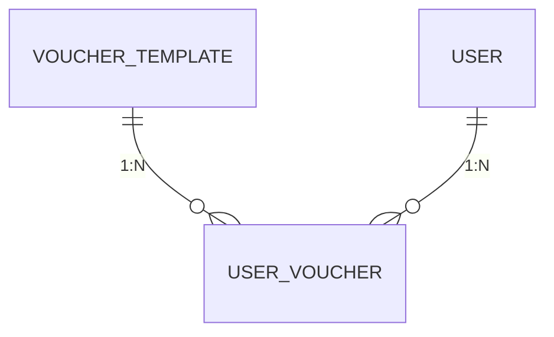

# 极简版代金券功能数据库设计文档

## 1. 文档概述

### 1.1 文档目的
本文档定义了极简版代金券功能的数据库设计，包括表结构、字段说明、索引设计、关系图等，为数据库开发和维护提供统一的标准。

### 1.2 设计范围
- 仅包含代金券相关的数据表
- 支持代金券模板管理
- 支持用户代金券管理
- 支持代金券状态管理

### 1.3 术语定义
| 术语 | 定义 |
|------|------|
| 代金券模板 | 定义代金券的基本属性，如面额、使用条件、有效期等 |
| 用户代金券 | 用户已拥有的代金券实例，包含状态信息 |
| 已领取 | 代金券已获得且在有效期内，未使用 |
| 已使用 | 代金券已被使用 |
| 已过期 | 代金券超出有效期 |

## 2. 数据库设计原则

### 2.1 设计风格
- 关系型数据库设计
- 第三范式（3NF）
- 清晰的表命名和字段命名
- 合理的索引设计
- 完整的约束定义

### 2.2 数据库选型
- MySQL 8.0
- 存储引擎：InnoDB
- 字符集：utf8mb4
- 排序规则：utf8mb4_0900_ai_ci

### 2.3 命名规范
- 表名：小写字母，下划线分隔，如 `user_voucher`
- 字段名：小写字母，下划线分隔，如 `face_value`
- 索引名：`idx_表名_字段名`，如 `idx_user_voucher_user_id`
- 外键名：`fk_表名_关联表名_关联字段`，如 `fk_user_voucher_voucher_id`

## 3. 表结构设计

### 3.1 整体关系图


### 3.2 表结构详细设计

#### 3.2.1 代金券模板表（voucher_template）
**功能**：存储代金券的基本配置信息

| 字段名 | 数据类型 | 约束 | 描述 |
|--------|----------|------|------|
| `id` | `varchar(32)` | `PRIMARY KEY` | 代金券模板ID，唯一标识 |
| `name` | `varchar(100)` | `NOT NULL` | 代金券名称 |
| `type` | `varchar(20)` | `NOT NULL` | 代金券类型，如：cash（现金券） |
| `face_value` | `decimal(10,2)` | `NOT NULL` | 面额，单位：元 |
| `min_spend` | `decimal(10,2)` | `NOT NULL` | 使用门槛，单位：元 |
| `status` | `tinyint` | `NOT NULL DEFAULT 1` | 模板状态：1-启用，0-禁用 |
| `start_time` | `date` | `NOT NULL` | 有效开始时间 |
| `end_time` | `datetime` | `NOT NULL` | 有效结束时间 |
| `issuer` | `varchar(100)` | `NOT NULL` | 发行方 |
| `description` | `varchar(200)` | `NOT NULL` | 简要描述 |
| `use_instructions` | `json` | `NOT NULL` | 使用须知，JSON格式数组 |
| `total_quantity` | `int` | `NOT NULL DEFAULT 0` | 总发行量，0表示无限量 |
| `created_at` | `datetime` | `NOT NULL DEFAULT CURRENT_TIMESTAMP` | 创建时间 |
| `updated_at` | `datetime` | `NOT NULL DEFAULT CURRENT_TIMESTAMP ON UPDATE CURRENT_TIMESTAMP` | 更新时间 |

#### 3.2.2 用户代金券表（user_voucher）
**功能**：存储用户拥有的代金券实例及其状态

| 字段名 | 数据类型 | 约束 | 描述 |
|--------|----------|------|------|
| `id` | `bigint` | `PRIMARY KEY AUTO_INCREMENT` | 自增主键 |
| `voucher_id` | `varchar(32)` | `NOT NULL` | 代金券ID，关联voucher_template.id |
| `user_id` | `varchar(32)` | `NOT NULL` | 用户ID，关联user.id |
| `status` | `varchar(20)` | `NOT NULL` | 状态：received（已领取）、used（已使用）、expired（已过期） |
| `created_at` | `datetime` | `NOT NULL DEFAULT CURRENT_TIMESTAMP` | 领取时间 |
| `used_at` | `datetime` | `NULL` | 使用时间，未使用则为NULL |
| `expired_at` | `datetime` | `NULL` | 过期时间，未过期则为NULL |
| `unique key` | `uk_user_voucher` | `(voucher_id, user_id)` | 唯一约束，确保用户对同一代金券只能领取一次 |
| `foreign key` | `fk_user_voucher_voucher_id` | `(voucher_id) REFERENCES voucher_template(id)` | 外键约束，关联代金券模板 |
| `foreign key` | `fk_user_voucher_user_id` | `(user_id) REFERENCES user(id)` | 外键约束，关联用户表 |

#### 3.2.3 用户表（user）
**功能**：存储用户基本信息（已存在，仅关联使用）

| 字段名 | 数据类型 | 约束 | 描述 |
|--------|----------|------|------|
| `id` | `varchar(32)` | `PRIMARY KEY` | 用户ID，唯一标识 |
| `nick_name` | `varchar(50)` | `NOT NULL` | 用户昵称 |
| `avatar` | `varchar(255)` | `NULL` | 用户头像 |
| `created_at` | `datetime` | `NOT NULL DEFAULT CURRENT_TIMESTAMP` | 创建时间 |
| `updated_at` | `datetime` | `NOT NULL DEFAULT CURRENT_TIMESTAMP ON UPDATE CURRENT_TIMESTAMP` | 更新时间 |

## 4. 索引设计

### 4.1 代金券模板表（voucher_template）
| 索引名 | 索引类型 | 索引字段 | 说明 |
|--------|----------|----------|------|
| `PRIMARY` | 主键索引 | `id` | 唯一标识，加速查询 |
| `idx_voucher_template_status` | 普通索引 | `status` | 按状态查询模板，加速查询 |
| `idx_voucher_template_start_time` | 普通索引 | `start_time` | 按开始时间查询，加速查询 |
| `idx_voucher_template_end_time` | 普通索引 | `end_time` | 按结束时间查询，加速查询 |

### 4.2 用户代金券表（user_voucher）
| 索引名 | 索引类型 | 索引字段 | 说明 |
|--------|----------|----------|------|
| `PRIMARY` | 主键索引 | `id` | 唯一标识，加速查询 |
| `uk_user_voucher` | 唯一索引 | `(voucher_id, user_id)` | 确保用户对同一代金券只能领取一次 |
| `idx_user_voucher_user_id` | 普通索引 | `user_id` | 按用户查询代金券，加速查询 |
| `idx_user_voucher_status` | 普通索引 | `status` | 按状态查询代金券，加速查询 |
| `idx_user_voucher_created_at` | 普通索引 | `created_at` | 按领取时间查询，加速查询 |
| `idx_user_voucher_used_at` | 普通索引 | `used_at` | 按使用时间查询，加速查询 |
| `idx_user_voucher_expired_at` | 普通索引 | `expired_at` | 按过期时间查询，加速查询 |
| `idx_user_voucher_user_status` | 联合索引 | `(user_id, status)` | 按用户和状态查询，加速常用查询 |

## 5. 视图设计

### 5.1 用户代金券视图（vw_user_voucher）
**功能**：简化用户代金券查询，关联模板信息

```sql
CREATE VIEW vw_user_voucher AS
SELECT 
    uv.id,
    uv.voucher_id,
    uv.user_id,
    uv.status,
    uv.created_at,
    uv.used_at,
    uv.expired_at,
    vt.name,
    vt.type,
    vt.face_value,
    vt.min_spend,
    vt.start_time,
    vt.end_time,
    vt.issuer,
    vt.description,
    vt.use_instructions
FROM user_voucher uv
LEFT JOIN voucher_template vt ON uv.voucher_id = vt.id;
```

## 6. 触发器设计

### 6.1 自动更新过期状态触发器
**功能**：定期检查并更新已过期的代金券状态

```sql
CREATE TRIGGER trg_update_voucher_expired_status
BEFORE INSERT ON user_voucher
FOR EACH ROW
BEGIN
    -- 插入时检查是否已过期
    IF NEW.status = 'received' AND NOW() > (SELECT end_time FROM voucher_template WHERE id = NEW.voucher_id) THEN
        SET NEW.status = 'expired';
        SET NEW.expired_at = NOW();
    END IF;
END;
```

## 7. 数据字典

### 7.1 代金券类型（voucher_template.type）
| 值 | 描述 |
|-----|------|
| cash | 现金券 |

### 7.2 代金券状态（user_voucher.status）
| 值 | 描述 |
|-----|------|
| received | 已领取（未使用，在有效期内） |
| used | 已使用 |
| expired | 已过期 |

### 7.3 模板状态（voucher_template.status）
| 值 | 描述 |
|-----|------|
| 1 | 启用 |
| 0 | 禁用 |

## 8. 数据初始化

### 8.1 代金券模板初始化示例
```sql
INSERT INTO voucher_template (
    id, name, type, face_value, min_spend, status, 
    start_time, end_time, issuer, description, use_instructions, total_quantity
) VALUES (
    'voucher_001', '9.9元代金券', 'cash', 9.90, 9.91, 1,
    '2025-12-02', '2026-11-30 23:59:59', '外卖券助手', '满9.91元可用', 
    '["每人限用1张", "具体使用规则以券面说明为准"]', 1000
);
```

### 8.2 用户代金券初始化示例
```sql
INSERT INTO user_voucher (
    voucher_id, user_id, status, created_at, used_at, expired_at
) VALUES (
    'voucher_001', 'user_001', 'received', '2025-12-01 10:00:00', NULL, NULL
);
```

## 9. 查询示例

### 9.1 查询用户已领取的代金券
```sql
SELECT * FROM vw_user_voucher 
WHERE user_id = 'user_001' AND status = 'received';
```

### 9.2 查询用户所有代金券
```sql
SELECT * FROM vw_user_voucher 
WHERE user_id = 'user_001'
ORDER BY created_at DESC;
```

### 9.3 查询代金券详情
```sql
SELECT * FROM vw_user_voucher 
WHERE id = 1;
```

### 9.4 统计用户各状态代金券数量
```sql
SELECT 
    status,
    COUNT(*) AS count
FROM user_voucher 
WHERE user_id = 'user_001'
GROUP BY status;
```

## 10. 性能优化建议

### 10.1 查询优化
- 优先使用视图 `vw_user_voucher` 进行查询，简化SQL语句
- 对频繁查询的字段创建索引，如 `user_id` 和 `status`
- 避免在WHERE子句中使用函数，影响索引效率

### 10.2 存储优化
- 定期清理过期数据，归档历史记录
- 合理设置数据类型，如使用 `decimal` 存储金额，避免浮点数精度问题
- 使用JSON类型存储 `use_instructions`，减少表字段数量

### 10.3 并发优化
- 使用InnoDB存储引擎，支持行级锁
- 合理设置事务隔离级别，避免死锁
- 对热点数据进行缓存，减少数据库访问压力

## 11. 安全性设计

### 11.1 数据安全
- 敏感数据加密存储
- 定期备份数据，确保数据可恢复
- 限制数据库用户权限，遵循最小权限原则

### 11.2 访问安全
- 禁止直接暴露数据库端口到公网
- 使用数据库连接池管理连接
- 定期更新数据库密码和密钥

## 12. 附录

### 12.1 数据库版本要求
- MySQL 8.0及以上
- 支持JSON数据类型
- 支持触发器

### 12.2 文档版本记录
| 版本 | 日期 | 作者 | 变更内容 |
|------|------|------|----------|
| V1.0 | 2026-01-06 | 数据库开发 | 初始版本，完成数据库设计文档编写 |

### 12.3 相关文档
- 《代金券功能需求设计文档》
- 《代金券功能接口文档》
