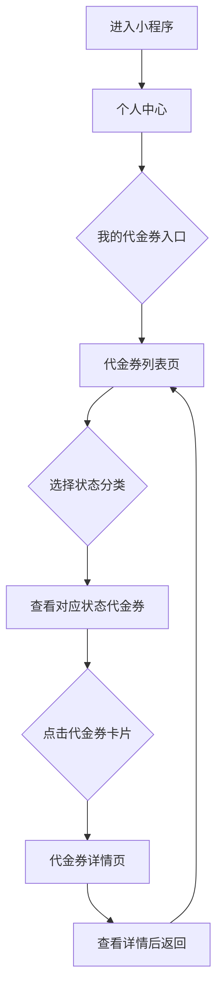

# 极简版代金券功能需求设计文档

## 1. 文档概述

### 1.1 文档目的
本文档旨在规范极简版代金券功能的需求、设计和实现，确保开发团队能够按照统一标准完成开发，提供符合用户期望的代金券展示功能。

### 1.2 功能范围
- 仅包含代金券展示功能，无领取、使用等交互操作
- 支持按状态（已领取、已使用、已过期）分类查看
- 提供代金券详情查看功能
- 纯信息展示，无任何与其他系统的关联逻辑

### 1.3 目标读者
- 产品经理
- UI/UX设计师
- 前端开发工程师
- 测试工程师

### 1.4 术语定义
| 术语 | 定义 |
|------|------|
| 代金券 | 用户已拥有的优惠券，可按状态分类查看 |
| 已领取 | 代金券已获得且在有效期内，未使用 |
| 已使用 | 代金券已被使用 |
| 已过期 | 代金券超出有效期 |

## 2. 需求分析

### 2.1 核心功能定位
- **仅展示功能**：展示用户已拥有的代金券，无任何交互操作
- **状态分类**：已领取、已使用、已过期
- **纯信息展示**：仅作为用户查看代金券信息的入口
- **无关联逻辑**：去掉所有与支付、订单、消息等系统的关联

### 2.2 功能模块
| 模块 | 功能描述 | 优先级 |
|------|----------|--------|
| 代金券列表页 | 展示用户已拥有的所有代金券，按状态分类 | P0 |
| 代金券详情页 | 展示单个代金券的详细信息 | P0 |
| 状态筛选功能 | 支持在已领取、已使用、已过期三个状态间切换 | P0 |

### 2.3 用户流程


## 3. UI设计

### 3.1 设计风格
- **整体风格**：深色背景+卡片式布局
- **色彩方案**：
  - 主色：红色（#FF4444）- 强调金额
  - 辅助色：橙色（#FF9900）- 状态提示
  - 文字色：白色（#FFFFFF）- 主文字，浅灰色（#CCCCCC）- 辅助文字
  - 背景色：黑色（#000000）- 页面背景，深灰色（#1A1A1A）- 卡片背景

### 3.2 页面设计

#### 3.2.1 代金券列表页
**布局结构**：
- 顶部导航栏：返回按钮 + "我的代金券"标题
- 状态筛选栏：已领取 | 已使用 | 已过期，下划线高亮当前状态
- 代金券卡片列表：垂直排列，每个卡片展示一张代金券

**代金券卡片设计**：
```
+-----------------------------------------------------------+
|  [发行方logo] 外卖券助手                                  |
|  深灰色背景（#1A1A1A），圆角8px，轻微阴影                  |
+-----------------------------------------------------------+
|  ¥9.9                          满¥9.91可用                |
|  主色红色（#FF4444）金额，白色（#FFFFFF）文字              |
|  商家满减券                     [已领取]                   |
|  浅灰色（#CCCCCC）辅助文字，状态标签橙色（#FF9900）        |
|  有效期至2026/11/30 23:59                                 |
|  浅灰色（#CCCCCC）辅助文字                                |
+-----------------------------------------------------------+
```

**状态标签设计**：
- **已领取**：橙色（#FF9900）圆角标签，白色文字，位于卡片右上角
- **已使用**：绿色（#00CC66）圆角标签，白色文字，卡片添加绿色半透明覆盖层
- **已过期**：灰色（#999999）圆角标签，白色文字，卡片添加灰色半透明覆盖层

**空状态设计**：
- 居中显示状态图标和提示文字
- 图标缓慢旋转（3秒一圈）
- 友好的提示文字

#### 3.2.2 代金券详情页
**布局结构**：
- 顶部导航栏：返回按钮 + "代金券详情"标题
- 详情内容区：垂直排列展示所有信息
- 无操作按钮：纯信息展示

**详情页内容设计**：
```
+-----------------------------------------------------------+
| < 返回  代金券详情 >                                      |
|                       深色背景（#000000）                  |
+-----------------------------------------------------------+
|  [外卖券助手]                                              |
|  深灰色背景（#1A1A1A）卡片，圆角8px，阴影效果              |
+-----------------------------------------------------------+
|  优惠说明 [展开/收起]                                     |
|  白色标题文字，右侧箭头图标，点击切换状态                 |
+-----------------------------------------------------------+
|  价值9.9元代金券一张；消费满9.91元可用                     |
|  主色红色渐变金额，浅灰色文字                             |
+-----------------------------------------------------------+
|  有效日期                                                 |
|  2025.12.02-2026.11.30                                    |
|  浅灰色文字                                               |
+-----------------------------------------------------------+
|  状态                                                     |
|  [已领取] 橙色标签，呼吸动画效果                          |
+-----------------------------------------------------------+
|  使用须知 [展开]                                          |
|  白色标题文字，默认显示2条，点击展开全部                  |
|  1、每人限用1张；                                         |
|  2、具体使用规则以券面说明为准。                           |
|  浅灰色文字                                               |
+-----------------------------------------------------------+
```

### 3.3 组件设计规范

#### 3.3.1 代金券卡片
- **尺寸**：宽度100%，高度90px
- **背景**：深灰色（#1A1A1A），圆角8px，轻微阴影
- **内容排布**：
  - 左上角：发行方名称（白色文字，14px）
  - 中间左侧：金额（红色#FF4444，24px）和类型（白色，12px）
  - 中间右侧：使用条件（白色，12px）
  - 右下角：有效期（浅灰色#CCCCCC，11px）
  - 右上角：状态标签（橙色#FF9900，12px，圆角10px）

#### 3.3.2 状态筛选栏
- **尺寸**：高度48px
- **背景**：黑色（#000000）
- **文字**：白色（#FFFFFF），16px
- **选中状态**：
  - 文字颜色：红色（#FF4444）
  - 底部下划线：红色（#FF4444），高度2px
- **间距**：每个状态选项间距20px

#### 3.3.3 详情页信息块
- **背景**：深灰色（#1A1A1A），圆角8px
- **内边距**：16px
- **标题样式**：白色（#FFFFFF），16px，加粗
- **内容样式**：浅灰色（#CCCCCC），14px
- **间距**：标题与内容间距8px，信息块之间间距12px

## 4. 交互设计

### 4.1 代金券列表页交互

#### 4.1.1 状态筛选栏交互
- **平滑下划线过渡**：点击切换状态时，红色下划线平滑滑动到对应选项
- **文字颜色渐变**：选中文字从白色平滑过渡到红色
- **点击反馈**：点击时选项轻微放大（1.05倍），0.1秒恢复
- **动画时长**：0.3秒

#### 4.1.2 代金券卡片交互
- **悬停效果**：手指触摸卡片时，卡片轻微上浮（2px）并添加红色阴影（#FF4444，模糊半径10px）
- **点击反馈**：点击瞬间卡片缩小至0.98倍，释放后恢复并跳转
- **状态标签动效**：卡片加载时，状态标签从右上角滑入
- **动画时长**：0.2秒

#### 4.1.3 列表滚动交互
- **滚动惯性**：保持自然的滚动惯性，提升流畅度
- **卡片渐入效果**：新进入视口的卡片从下往上渐入（opacity从0到1，translateY从20px到0）
- **动画时长**：0.5秒

### 4.2 代金券详情页交互

#### 4.2.1 页面跳转交互
- **平滑过渡**：从列表页到详情页使用从右往左滑入效果，返回时从左往右滑出
- **卡片缩放过渡**：点击卡片时，先放大至全屏，然后显示详情内容
- **动画时长**：0.3秒

#### 4.2.2 信息展示交互
- **使用须知折叠/展开**：默认显示前2条，点击"展开"显示全部，"收起"隐藏多余内容
- **信息块悬浮效果**：滚动时，当前查看的信息块轻微上浮，与其他信息区分
- **动画时长**：0.2秒

#### 4.2.3 状态标签交互
- **动态呼吸效果**：已领取状态的橙色标签添加呼吸动画（透明度0.8-1-0.8循环）
- **已使用/过期标签**：添加轻微抖动效果，吸引用户注意
- **动画时长**：2秒（呼吸动画），0.5秒（抖动动画）

### 4.3 全局交互优化

#### 4.3.1 加载状态优化
- **骨架屏**：列表页显示卡片骨架屏，详情页显示信息块骨架屏
- **骨架屏动效**：骨架屏添加渐变扫描动画（从左到右的浅色条纹）
- **动画时长**：1.5秒

#### 4.3.2 导航栏交互
- **返回按钮动效**：点击返回按钮时，按钮旋转180度
- **标题淡入**：页面加载时，标题从透明渐变为白色
- **动画时长**：0.3秒

## 5. 数据设计

### 5.1 数据结构
```javascript
// 代金券数据结构
{
  id: 'voucher_001',              // 代金券ID
  name: '9.9元代金券',            // 代金券名称
  type: 'cash',                   // 类型：cash(现金券)
  faceValue: 9.9,                 // 面额
  minSpend: 9.91,                 // 使用门槛
  status: 'received',             // 状态：received(已领取)、used(已使用)、expired(已过期)
  startTime: '2025-12-02',        // 有效开始时间
  endTime: '2026-11-30 23:59:59', // 有效结束时间
  issuer: '外卖券助手',            // 发行方
  description: '满9.91元可用',     // 简要描述
  useInstructions: [              // 使用须知
    '每人限用1张',
    '具体使用规则以券面说明为准'
  ]
}
```

### 5.2 数据流转
1. 前端通过API获取用户代金券列表数据
2. 数据存储在前端状态管理中
3. 根据用户选择的状态筛选显示对应代金券
4. 点击卡片时，根据ID获取对应代金券详情
5. 详情页展示该代金券的详细信息

## 6. 实现建议

### 6.1 技术栈建议
- **框架**：Taro框架，适配小程序开发
- **状态管理**：简单使用React Context或useState，无需复杂状态管理库
- **UI组件库**：可使用项目现有组件库，或自行开发
- **CSS预处理器**：Sass/SCSS，便于样式管理

### 6.2 代码组织建议
- **组件化开发**：将卡片、筛选栏、骨架屏等封装为独立组件
- **CSS变量**：使用CSS变量定义颜色、字体大小等，便于统一维护
- **动画分离**：将动画效果单独封装，便于维护和扩展
- **性能优化**：
  - 使用CSS will-change属性优化动画性能
  - 避免在滚动时触发复杂动画
  - 合理使用React.memo和useMemo减少不必要的渲染

### 6.3 注意事项
- 确保深色主题下的文字可读性，文字颜色对比度符合WCAG标准
- 动画效果要流畅，避免卡顿和延迟
- 适配不同尺寸的设备，确保在各种屏幕上都有良好的显示效果
- 考虑小程序的性能限制，避免过度使用复杂动画

## 7. 验收标准

### 7.1 功能验收标准
| 功能点 | 验收标准 |
|--------|----------|
| 代金券列表展示 | 1. 正确展示用户已拥有的代金券<br>2. 按状态分类准确<br>3. 卡片信息完整 |
| 状态筛选功能 | 1. 点击筛选选项可切换状态<br>2. 选中状态高亮显示<br>3. 列表内容随状态切换正确更新 |
| 代金券详情查看 | 1. 点击卡片可跳转到详情页<br>2. 详情页信息完整<br>3. 可返回列表页 |
| 空状态展示 | 1. 各状态下空状态显示正确<br>2. 提示文字友好<br>3. 图标动画正常 |

### 7.2 交互验收标准
| 交互点 | 验收标准 |
|--------|----------|
| 状态筛选栏交互 | 1. 下划线平滑过渡<br>2. 文字颜色渐变<br>3. 点击反馈明显 |
| 卡片交互 | 1. 悬停效果明显<br>2. 点击反馈及时<br>3. 状态标签动效正常 |
| 页面跳转 | 1. 过渡动画流畅<br>2. 无卡顿延迟<br>3. 返回按钮功能正常 |
| 信息展示交互 | 1. 使用须知可折叠/展开<br>2. 状态标签动画正常<br>3. 加载状态显示正确 |

### 7.3 UI验收标准
| UI点 | 验收标准 |
|------|----------|
| 颜色方案 | 1. 严格遵循设计文档的颜色方案<br>2. 深色主题下文字可读性良好<br>3. 颜色对比符合标准 |
| 布局结构 | 1. 布局结构符合设计文档<br>2. 间距合理<br>3. 各组件尺寸准确 |
| 视觉效果 | 1. 卡片阴影效果明显<br>2. 状态标签视觉区分清晰<br>3. 整体视觉风格统一 |

## 8. 附录

### 8.1 参考设计
- 参考现有优惠券设计，采用深色背景+卡片式布局
- 主色：红色（#FF4444）用于强调金额
- 辅助色：橙色（#FF9900）用于状态提示
- 文字色：白色（#FFFFFF）、浅灰色（#CCCCCC）
- 背景色：黑色（#000000）、深灰色（#1A1A1A）

### 8.2 设计资源
- 代金券状态图标
- 骨架屏设计图
- 动画效果参考视频

### 8.3 文档版本记录
| 版本 | 日期 | 作者 | 变更内容 |
|------|------|------|----------|
| V1.0 | 2026-01-06 | 产品经理 | 初始版本，完成需求设计文档 |
