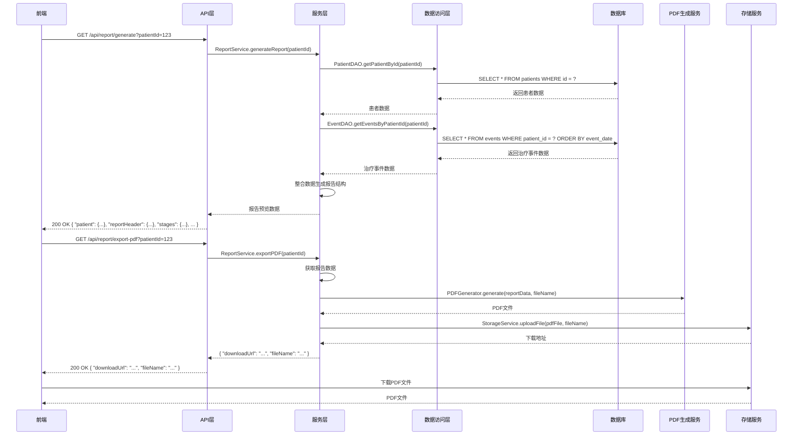

# 患者问诊病历报告系统后端详细设计文档

## 1. 设计概览

### 1.1 设计目标
本设计旨在实现一个高性能、可扩展的患者问诊病历报告系统后端，支持从现有系统中整合患者数据和治疗事件数据，生成标准化的病历报告，并提供PDF导出功能。系统采用Java技术栈开发，确保在企业级应用环境中稳定运行。

### 1.2 设计原则
- **高内聚低耦合**：模块化设计，便于维护和扩展
- **性能优先**：优化数据库查询和PDF生成过程
- **安全性**：确保患者数据的安全存储和传输
- **可扩展性**：支持未来功能的扩展和集成

## 2. 技术栈

| 技术 | 版本 | 用途 |
|------|------|------|
| Java | 11.0+ | 后端开发语言 |
| Spring Boot | 2.7.0+ | 后端框架 |
| Spring MVC | 5.3.0+ | Web框架 |
| MyBatis | 3.5.0+ | ORM框架 |
| MySQL | 8.0+ | 数据库 |
| iText | 7.0+ | PDF生成库 |
| Redis | 6.0+ | 缓存 |
| Docker | 20.0+ | 容器化部署 |

## 3. 系统架构

### 3.1 架构概览
- **架构风格**：三层架构（表示层、业务逻辑层、数据访问层）
- **模块划分**：
  - API层：处理HTTP请求和响应
  - 服务层：实现业务逻辑
  - 数据访问层：与数据库交互
  - 工具层：提供通用功能

### 3.2 核心流程图


## 4. 目录结构

```
src/
├── main/
│   ├── java/
│   │   └── com/
│   │       └── medical/
│   │           ├── controller/
│   │           │   └── ReportController.java       # 报告相关API控制器
│   │           ├── service/
│   │           │   ├── ReportService.java          # 报告服务接口
│   │           │   └── impl/
│   │           │       └── ReportServiceImpl.java   # 报告服务实现
│   │           ├── dao/
│   │           │   ├── PatientDAO.java              # 患者数据访问
│   │           │   └── EventDAO.java                # 事件数据访问
│   │           ├── model/
│   │           │   ├── Patient.java                 # 患者模型
│   │           │   ├── Event.java                   # 事件模型
│   │           │   └── ReportData.java              # 报告数据模型
│   │           ├── util/
│   │           │   └── PDFGenerator.java            # PDF生成工具
│   │           └── config/
│   │               └── AppConfig.java               # 应用配置
│   └── resources/
│       ├── mapper/
│       │   ├── PatientMapper.xml                   # 患者SQL映射
│       │   └── EventMapper.xml                     # 事件SQL映射
│       └── application.yml                         # 应用配置文件
└── test/
    └── java/
        └── com/
            └── medical/
                └── service/
                    └── ReportServiceTest.java       # 报告服务测试
```

## 5. 核心类设计

### 5.1 控制器类

#### 5.1.1 ReportController
- **文件路径**：`src/main/java/com/medical/controller/ReportController.java`
- **职责**：处理报告生成和PDF导出的HTTP请求
- **核心方法**：
  - `generateReport`：生成病历报告预览数据
  - `exportPDF`：导出PDF格式的病历报告

#### 5.1.2 代码示例
```java
package com.medical.controller;

import com.medical.service.ReportService;
import com.medical.model.ReportData;
import org.springframework.beans.factory.annotation.Autowired;
import org.springframework.http.HttpHeaders;
import org.springframework.http.MediaType;
import org.springframework.http.ResponseEntity;
import org.springframework.web.bind.annotation.*;

import javax.servlet.http.HttpServletResponse;
import java.io.IOException;
import java.io.OutputStream;

@RestController
@RequestMapping("/api/report")
public class ReportController {

    @Autowired
    private ReportService reportService;

    /**
     * 生成病历报告预览数据
     * @param patientId 患者ID
     * @return 报告预览数据
     */
    @GetMapping("/generate")
    public ResponseEntity<ReportData> generateReport(@RequestParam("patientId") String patientId) {
        ReportData reportData = reportService.generateReport(patientId);
        return ResponseEntity.ok(reportData);
    }

    /**
     * 导出PDF格式的病历报告
     * @param patientId 患者ID
     * @return 包含下载地址和文件名的响应
     */
    @GetMapping("/export-pdf")
    public ResponseEntity<Map<String, String>> exportPDF(@RequestParam("patientId") String patientId) {
        // 生成PDF并获取下载地址和文件名
        Map<String, String> result = reportService.exportPDF(patientId);
        return ResponseEntity.ok(result);
    }
}
```

### 5.2 服务类

#### 5.2.1 ReportService
- **文件路径**：`src/main/java/com/medical/service/ReportService.java`
- **职责**：定义报告相关的业务逻辑接口
- **核心方法**：
  - `generateReport`：生成报告预览数据
  - `exportPDF`：导出PDF报告

#### 5.2.2 ReportServiceImpl
- **文件路径**：`src/main/java/com/medical/service/impl/ReportServiceImpl.java`
- **职责**：实现报告相关的业务逻辑
- **核心方法**：
  - `generateReport`：整合患者数据和治疗事件数据，生成报告结构
  - `exportPDF`：调用PDF生成工具生成PDF文件

#### 5.2.3 代码示例
```java
package com.medical.service;

import com.medical.model.ReportData;
import java.util.Map;

public interface ReportService {
    /**
     * 生成报告预览数据
     * @param patientId 患者ID
     * @return 报告预览数据
     */
    ReportData generateReport(String patientId);

    /**
     * 导出PDF报告
     * @param patientId 患者ID
     * @return 包含下载地址和文件名的Map
     */
    Map<String, String> exportPDF(String patientId);
}

/**
 * 存储服务接口
 */
interface StorageService {
    /**
     * 上传文件
     * @param file 文件
     * @param fileName 文件名
     * @return 下载地址
     */
    String uploadFile(File file, String fileName);
}
```

```java
package com.medical.service.impl;

import com.medical.service.ReportService;
import com.medical.dao.PatientDAO;
import com.medical.dao.EventDAO;
import com.medical.model.Patient;
import com.medical.model.Event;
import com.medical.model.ReportData;
import com.medical.util.PDFGenerator;
import org.springframework.beans.factory.annotation.Autowired;
import org.springframework.stereotype.Service;

import java.io.OutputStream;
import java.util.List;

@Service
public class ReportServiceImpl implements ReportService {

    @Autowired
    private PatientDAO patientDAO;

    @Autowired
    private EventDAO eventDAO;

    @Autowired
    private PDFGenerator pdfGenerator;

    @Autowired
    private StorageService storageService;

    @Override
    public ReportData generateReport(String patientId) {
        // 获取患者数据
        Patient patient = patientDAO.getPatientById(patientId);
        if (patient == null) {
            throw new RuntimeException("患者不存在");
        }

        // 获取治疗事件数据
        List<Event> events = eventDAO.getEventsByPatientId(patientId);

        // 整合数据生成报告结构
        ReportData reportData = new ReportData();
        reportData.setPatient(patient);
        
        // 分类处理事件数据
        // TODO: 实现事件分类逻辑

        return reportData;
    }

    @Override
    public Map<String, String> exportPDF(String patientId) {
        // 获取报告数据
        ReportData reportData = generateReport(patientId);
        
        // 生成PDF文件
        String fileName = "患者" + reportData.getPatient().getName() + "_病历报告_" + LocalDateTime.now().format(DateTimeFormatter.ofPattern("yyyy-MM-dd")) + ".pdf";
        File pdfFile = pdfGenerator.generate(reportData, fileName);
        
        // 上传PDF文件到存储服务并获取下载地址
        String downloadUrl = storageService.uploadFile(pdfFile, fileName);
        
        // 构建返回结果
        Map<String, String> result = new HashMap<>();
        result.put("downloadUrl", downloadUrl);
        result.put("fileName", fileName);
        
        return result;
    }
}
```

### 5.3 数据访问类

#### 5.3.1 PatientDAO
- **文件路径**：`src/main/java/com/medical/dao/PatientDAO.java`
- **职责**：定义患者数据访问接口
- **核心方法**：
  - `getPatientById`：根据ID获取患者信息

#### 5.3.2 EventDAO
- **文件路径**：`src/main/java/com/medical/dao/EventDAO.java`
- **职责**：定义事件数据访问接口
- **核心方法**：
  - `getEventsByPatientId`：根据患者ID获取事件列表

#### 5.3.3 代码示例
```java
package com.medical.dao;

import com.medical.model.Patient;

public interface PatientDAO {
    /**
     * 根据ID获取患者信息
     * @param id 患者ID
     * @return 患者信息
     */
    Patient getPatientById(String id);
}
```

```java
package com.medical.dao;

import com.medical.model.Event;
import java.util.List;

public interface EventDAO {
    /**
     * 根据患者ID获取事件列表
     * @param patientId 患者ID
     * @return 事件列表
     */
    List<Event> getEventsByPatientId(String patientId);
}
```

### 5.4 模型类

#### 5.4.1 Patient
- **文件路径**：`src/main/java/com/medical/model/Patient.java`
- **职责**：定义患者数据模型

#### 5.4.2 Event
- **文件路径**：`src/main/java/com/medical/model/Event.java`
- **职责**：定义事件数据模型

#### 5.4.3 ReportData
- **文件路径**：`src/main/java/com/medical/model/ReportData.java`
- **职责**：定义报告数据模型

#### 5.4.4 代码示例
```java
package com.medical.model;

import java.util.List;

public class Patient {
    private String id;
    private String name;
    private Integer gender; // 1: 男, 2: 女
    private Integer age;
    private Float height;
    private Float weight;
    private String phone;
    private String diseaseName;
    private String pastMedicalHistory;
    private String allergyHistory;
    private String familyHistory;
    
    // getter和setter方法
    // TODO: 实现getter和setter
}
```

```java
package com.medical.model;

import java.util.Date;

public class Event {
    private String id;
    private String patientId;
    private String type;
    private Date eventDate;
    private String content;
    private String hospital;
    private String doctor;
    
    // getter和setter方法
    // TODO: 实现getter和setter
}
```

```java
package com.medical.model;

import java.util.List;

public class ReportData {
    private Patient patient;
    private ReportHeader reportHeader;
    private Stages stages;
    private String otherDiseases;
    private String currentStatus;
    private String diseaseName;
    private List<Inspection> inspections;
    
    // getter和setter方法
    // TODO: 实现getter和setter
}

class ReportHeader {
    private String companyName;
    private String companyFullName;
    private String title;
    
    // getter和setter方法
}

class Stages {
    private List<StageEvent> first;
    private List<StageEvent> second;
    
    // getter和setter方法
}

class StageEvent {
    private String date;
    private String content;
    
    // getter和setter方法
}

class Inspection {
    private String date;
    private String title;
    private String content;
    private String hospital;
    
    // getter和setter方法
}
```

### 5.5 工具类

#### 5.5.1 PDFGenerator
- **文件路径**：`src/main/java/com/medical/util/PDFGenerator.java`
- **职责**：生成PDF格式的病历报告
- **核心方法**：
  - `generate`：根据报告数据生成PDF文件

#### 5.5.2 代码示例
```java
package com.medical.util;

import com.medical.model.ReportData;
import com.itextpdf.io.font.PdfEncodings;
import com.itextpdf.kernel.colors.ColorConstants;
import com.itextpdf.kernel.font.PdfFont;
import com.itextpdf.kernel.font.PdfFontFactory;
import com.itextpdf.kernel.pdf.PdfDocument;
import com.itextpdf.kernel.pdf.PdfWriter;
import com.itextpdf.layout.Document;
import com.itextpdf.layout.element.Paragraph;
import com.itextpdf.layout.element.Table;
import com.itextpdf.layout.property.TextAlignment;

import java.io.OutputStream;
import java.io.IOException;

@Component
public class PDFGenerator {

    /**
     * 生成PDF格式的病历报告
     * @param reportData 报告数据
     * @param fileName 文件名
     * @return 生成的PDF文件
     * @throws IOException IO异常
     */
    public File generate(ReportData reportData, String fileName) throws IOException {
        // 创建临时文件
        File pdfFile = File.createTempFile("medical_report", ".pdf");
        
        // 创建PDF文档
        PdfWriter writer = new PdfWriter(pdfFile);
        PdfDocument pdf = new PdfDocument(writer);
        Document document = new Document(pdf);

        try {
            // 设置中文字体
            PdfFont font = PdfFontFactory.createFont("STSongStd-Light", "UniGB-UCS2-H", PdfEncodings.IDENTITY_H);
            document.setFont(font);

            // 添加标题
            Paragraph title = new Paragraph("患者问诊病历报告")
                    .setFontSize(24)
                    .setTextAlignment(TextAlignment.CENTER)
                    .setBold()
                    .setMarginBottom(30);
            document.add(title);

            // 添加患者基本信息
            addPatientInfo(document, reportData, font);

            // 添加疾病诊断
            addDiseaseInfo(document, reportData, font);

            // 添加治疗过程
            addTreatmentInfo(document, reportData, font);

            // 添加检查结果
            addInspectionInfo(document, reportData, font);

            // 添加基础病史
            addMedicalHistory(document, reportData, font);

            // 关闭文档
            document.close();
            
            return pdfFile;
        } catch (Exception e) {
            throw new IOException("PDF生成失败", e);
        }
    }

    /**
     * 添加患者基本信息
     */
    private void addPatientInfo(Document document, ReportData reportData, PdfFont font) {
        // TODO: 实现患者基本信息添加逻辑
    }

    /**
     * 添加疾病诊断信息
     */
    private void addDiseaseInfo(Document document, ReportData reportData, PdfFont font) {
        // TODO: 实现疾病诊断信息添加逻辑
    }

    /**
     * 添加治疗过程信息
     */
    private void addTreatmentInfo(Document document, ReportData reportData, PdfFont font) {
        // TODO: 实现治疗过程信息添加逻辑
    }

    /**
     * 添加检查结果信息
     */
    private void addInspectionInfo(Document document, ReportData reportData, PdfFont font) {
        // TODO: 实现检查结果信息添加逻辑
    }

    /**
     * 添加基础病史信息
     */
    private void addMedicalHistory(Document document, ReportData reportData, PdfFont font) {
        // TODO: 实现基础病史信息添加逻辑
    }
}
```

## 6. 数据库设计

### 6.1 现有表结构

#### 6.1.1 patients表
| 字段名 | 数据类型 | 约束 | 描述 |
|-------|---------|------|------|
| id | VARCHAR(36) | PRIMARY KEY | 患者ID |
| name | VARCHAR(50) | NOT NULL | 患者姓名 |
| gender | INT | NOT NULL | 性别（1:男，2:女） |
| age | INT | NOT NULL | 年龄 |
| height | FLOAT | | 身高（cm） |
| weight | FLOAT | | 体重（kg） |
| phone | VARCHAR(20) | | 联系方式 |
| created_at | TIMESTAMP | DEFAULT CURRENT_TIMESTAMP | 创建时间 |
| updated_at | TIMESTAMP | DEFAULT CURRENT_TIMESTAMP ON UPDATE CURRENT_TIMESTAMP | 更新时间 |

#### 6.1.2 histories表
| 字段名 | 数据类型 | 约束 | 描述 |
|-------|---------|------|------|
| id | VARCHAR(36) | PRIMARY KEY | 病史ID |
| patient_id | VARCHAR(36) | FOREIGN KEY | 患者ID |
| type | INT | NOT NULL | 病史类型（0:疾病名称，1:既往病史，2:过敏史，3:家族病史） |
| content | TEXT | | 病史内容 |
| record_date | DATE | NOT NULL | 记录日期 |
| created_at | TIMESTAMP | DEFAULT CURRENT_TIMESTAMP | 创建时间 |

#### 6.1.3 events表
| 字段名 | 数据类型 | 约束 | 描述 |
|-------|---------|------|------|
| id | VARCHAR(36) | PRIMARY KEY | 事件ID |
| patient_id | VARCHAR(36) | FOREIGN KEY | 患者ID |
| type | VARCHAR(20) | NOT NULL | 事件类型（treatment:治疗，inspection:检查，medication:用药，common:通用） |
| event_date | DATE | NOT NULL | 事件日期 |
| content | TEXT | NOT NULL | 事件内容 |
| hospital | VARCHAR(100) | | 医疗机构 |
| doctor | VARCHAR(50) | | 主治医生 |
| created_at | TIMESTAMP | DEFAULT CURRENT_TIMESTAMP | 创建时间 |
| updated_at | TIMESTAMP | DEFAULT CURRENT_TIMESTAMP ON UPDATE CURRENT_TIMESTAMP | 更新时间 |

### 6.2 SQL映射文件

#### 6.2.1 PatientMapper.xml
```xml
<?xml version="1.0" encoding="UTF-8" ?>
<!DOCTYPE mapper PUBLIC "-//mybatis.org//DTD Mapper 3.0//EN" "http://mybatis.org/dtd/mybatis-3-mapper.dtd">
<mapper namespace="com.medical.dao.PatientDAO">
    <resultMap id="PatientResultMap" type="com.medical.model.Patient">
        <id column="id" property="id"/>
        <result column="name" property="name"/>
        <result column="gender" property="gender"/>
        <result column="age" property="age"/>
        <result column="height" property="height"/>
        <result column="weight" property="weight"/>
        <result column="phone" property="phone"/>
    </resultMap>

    <select id="getPatientById" resultMap="PatientResultMap">
        SELECT id, name, gender, age, height, weight, phone
        FROM patients
        WHERE id = #{id}
    </select>

    <select id="getPatientWithHistories" resultType="com.medical.model.Patient">
        SELECT p.id, p.name, p.gender, p.age, p.height, p.weight, p.phone,
               h1.content as diseaseName,
               h2.content as pastMedicalHistory,
               h3.content as allergyHistory,
               h4.content as familyHistory
        FROM patients p
        LEFT JOIN histories h1 ON p.id = h1.patient_id AND h1.type = 0
        LEFT JOIN histories h2 ON p.id = h2.patient_id AND h2.type = 1
        LEFT JOIN histories h3 ON p.id = h3.patient_id AND h3.type = 2
        LEFT JOIN histories h4 ON p.id = h4.patient_id AND h4.type = 3
        WHERE p.id = #{id}
    </select>
</mapper>
```

#### 6.2.2 EventMapper.xml
```xml
<?xml version="1.0" encoding="UTF-8" ?>
<!DOCTYPE mapper PUBLIC "-//mybatis.org//DTD Mapper 3.0//EN" "http://mybatis.org/dtd/mybatis-3-mapper.dtd">
<mapper namespace="com.medical.dao.EventDAO">
    <resultMap id="EventResultMap" type="com.medical.model.Event">
        <id column="id" property="id"/>
        <result column="patient_id" property="patientId"/>
        <result column="type" property="type"/>
        <result column="event_date" property="eventDate"/>
        <result column="content" property="content"/>
        <result column="hospital" property="hospital"/>
        <result column="doctor" property="doctor"/>
    </resultMap>

    <select id="getEventsByPatientId" resultMap="EventResultMap">
        SELECT id, patient_id, type, event_date, content, hospital, doctor
        FROM events
        WHERE patient_id = #{patientId}
        ORDER BY event_date DESC
    </select>
</mapper>
```

## 7. API设计

### 7.1 API列表

| API路径 | 方法 | 模块 | 功能描述 | 请求参数 | 成功响应 |
|---------|------|------|----------|----------|----------|
| `/api/report/generate` | POST | ReportController | 生成病历报告预览数据 | patientId: String | `{"patient": {...}, "diseaseName": "...", "treatments": [...], "inspections": [...], "pastMedicalHistory": "...", "allergyHistory": "...", "familyHistory": "..."}` |
| `/api/report/export` | POST | ReportController | 导出PDF格式的病历报告 | patientId: String | PDF文件流 |

### 7.2 请求示例

#### 7.2.1 生成报告预览
```http
POST /api/report/generate
Content-Type: application/x-www-form-urlencoded

patientId=123456
```

#### 7.2.2 导出PDF报告
```http
POST /api/report/export
Content-Type: application/x-www-form-urlencoded

patientId=123456
```

### 7.3 响应示例

#### 7.3.1 生成报告预览成功
```json
{
  "patient": {
    "id": "123456",
    "name": "张三",
    "gender": 1,
    "age": 60,
    "height": 164,
    "weight": 65,
    "phone": "13800138000"
  },
  "diseaseName": "中分化食管癌",
  "treatments": [
    {
      "date": "2025-07-07",
      "content": "入院进行食管癌手术，术后恢复良好"
    },
    {
      "date": "2025-05-10",
      "content": "接受化疗联合免疫治疗"
    }
  ],
  "inspections": [
    {
      "date": "2025-07-01",
      "content": "胃镜检查：距门齿约30-35cm见一溃疡隆起性病变，中央凹陷"
    },
    {
      "date": "2025-05-30",
      "content": "PET-CT检查：食管癌化疗3疗程后，肿瘤活性仍存在"
    }
  ],
  "pastMedicalHistory": "高血压病史十年，平日吃降压药",
  "allergyHistory": "无",
  "familyHistory": "患者父亲曾患脑出血"
}
```

#### 7.3.2 导出PDF报告成功
- 响应类型：`application/pdf`
- 响应体：PDF文件流

## 8. 性能优化

### 8.1 数据库优化
1. **索引优化**：
   - 在patients表的id字段上创建主键索引
   - 在events表的patient_id字段上创建索引
   - 在histories表的patient_id和type字段上创建联合索引

2. **查询优化**：
   - 使用预编译语句，避免SQL注入
   - 优化SQL查询，减少不必要的字段查询
   - 使用分页查询，避免一次性查询过多数据

3. **连接池优化**：
   - 配置合适的数据库连接池大小
   - 实现连接池的监控和管理

### 8.2 缓存优化
1. **Redis缓存**：
   - 缓存患者基本信息，减少数据库查询
   - 缓存治疗事件数据，提高数据访问速度
   - 设置合理的缓存过期时间

2. **本地缓存**：
   - 使用Caffeine等本地缓存框架，缓存热点数据
   - 减少远程缓存的访问压力

### 8.3 PDF生成优化
1. **内存优化**：
   - 使用流式处理，避免一次性加载大量数据到内存
   - 及时释放不再使用的资源

2. **并发优化**：
   - 使用异步处理，避免阻塞主线程
   - 实现PDF生成任务的队列管理

3. **模板优化**：
   - 预定义PDF模板，减少动态生成的开销
   - 优化PDF文档结构，提高生成速度

### 8.4 服务优化
1. **线程池优化**：
   - 配置合适的线程池大小
   - 实现线程池的监控和管理

2. **异步处理**：
   - 使用CompletableFuture等异步编程方式
   - 提高系统的并发处理能力

3. **负载均衡**：
   - 实现服务的水平扩展
   - 使用负载均衡器分发请求

## 9. 安全设计

### 9.1 认证与授权
1. **API认证**：
   - 实现基于Token的认证机制
   - 验证请求的合法性

2. **权限控制**：
   - 实现基于角色的权限控制
   - 确保只有授权用户能访问报告生成功能

### 9.2 数据安全
1. **数据加密**：
   - 对敏感数据进行加密存储
   - 使用HTTPS确保数据传输安全

2. **数据脱敏**：
   - 对患者敏感信息进行脱敏处理
   - 确保数据在前端展示时的安全性

3. **审计日志**：
   - 记录API调用日志
   - 实现操作审计，追踪数据访问记录

### 9.3 防攻击措施
1. **SQL注入防护**：
   - 使用预编译语句
   - 实现输入参数验证

2. **XSS防护**：
   - 对输入数据进行过滤
   - 对输出数据进行转义

3. **CSRF防护**：
   - 实现CSRF令牌验证
   - 确保请求的合法性

4. **DoS防护**：
   - 实现请求频率限制
   - 防止恶意请求攻击

## 10. 部署设计

### 10.1 部署架构
- **架构风格**：微服务架构
- **部署方式**：Docker容器化部署
- **环境配置**：
  - 开发环境：本地Docker容器
  - 测试环境：测试服务器Docker容器
  - 生产环境：生产服务器Docker容器集群

### 10.2 Docker配置

#### 10.2.1 Dockerfile
```dockerfile
FROM openjdk:11-jre-slim

WORKDIR /app

COPY target/medical-report-service.jar /app/

EXPOSE 8080

ENTRYPOINT ["java", "-jar", "medical-report-service.jar"]
```

#### 10.2.2 docker-compose.yml
```yaml
version: '3'
services:
  medical-report-service:
    build: .
    ports:
      - "8080:8080"
    environment:
      - SPRING_DATASOURCE_URL=jdbc:mysql://mysql:3306/medical_db
      - SPRING_DATASOURCE_USERNAME=root
      - SPRING_DATASOURCE_PASSWORD=password
      - SPRING_REDIS_HOST=redis
      - SPRING_REDIS_PORT=6379
    depends_on:
      - mysql
      - redis

  mysql:
    image: mysql:8.0
    environment:
      - MYSQL_ROOT_PASSWORD=password
      - MYSQL_DATABASE=medical_db
    volumes:
      - mysql-data:/var/lib/mysql

  redis:
    image: redis:6.0

volumes:
  mysql-data:
```

### 10.3 监控与告警
1. **监控指标**：
   - 服务运行状态
   - API调用频率和响应时间
   - 数据库连接和查询性能
   - 内存和CPU使用率

2. **告警机制**：
   - 实现基于阈值的告警
   - 配置告警通知渠道（邮件、短信等）

3. **日志管理**：
   - 集中化日志管理
   - 实现日志分析和监控

## 11. 测试计划

### 11.1 单元测试
- **测试框架**：JUnit 5 + Mockito
- **测试范围**：
  - 服务层方法测试
  - 工具类测试
  - 数据访问层测试

### 11.2 集成测试
- **测试框架**：Spring Boot Test
- **测试范围**：
  - API接口测试
  - 服务层集成测试
  - 数据库交互测试

### 11.3 端到端测试
- **测试工具**：Postman / JMeter
- **测试范围**：
  - 完整的报告生成流程测试
  - PDF导出功能测试
  - 性能测试

### 11.4 测试用例

| 测试用例ID | 测试用例名称 | 测试步骤 | 预期结果 |
|-----------|-------------|---------|----------|
| TC001 | 生成报告预览成功 | 1. 调用POST /api/report/generate接口<br>2. 传入有效的patientId | 返回200 OK，包含完整的报告数据 |
| TC002 | 生成报告预览失败-患者不存在 | 1. 调用POST /api/report/generate接口<br>2. 传入不存在的patientId | 返回400 Bad Request，提示患者不存在 |
| TC003 | 导出PDF报告成功 | 1. 调用POST /api/report/export接口<br>2. 传入有效的patientId | 返回200 OK，包含PDF文件流 |
| TC004 | 导出PDF报告失败-患者不存在 | 1. 调用POST /api/report/export接口<br>2. 传入不存在的patientId | 返回400 Bad Request，提示患者不存在 |
| TC005 | 性能测试-并发请求 | 1. 使用JMeter模拟100个并发请求<br>2. 调用报告生成接口 | 所有请求成功完成，平均响应时间<500ms |

## 12. 维护与扩展

### 12.1 维护计划
- **定期检查**：定期检查服务运行状态和性能
- **日志分析**：定期分析日志，发现并解决潜在问题
- **数据库维护**：定期进行数据库备份和优化
- **依赖更新**：定期更新依赖库，修复安全漏洞

### 12.2 扩展计划
- **功能扩展**：
  - 支持自定义报告模板
  - 支持报告分享功能
  - 支持报告历史记录查询

- **集成扩展**：
  - 与电子病历系统集成
  - 与医院信息系统(HIS)集成
  - 与医保系统集成

- **技术扩展**：
  - 支持更多PDF格式定制
  - 支持其他文档格式导出（如Word、Excel）
  - 实现AI辅助诊断建议

## 13. 总结

本设计文档详细描述了患者问诊病历报告系统后端的技术实现方案，包括系统架构、目录结构、核心类设计、数据库设计、API设计等内容。系统采用Java技术栈开发，使用Spring Boot框架构建，结合iText库实现PDF生成功能，确保了系统的性能、安全性和可扩展性。

通过本设计，系统能够实现从现有患者数据和治疗事件时间轴中整合信息，生成标准化的病历报告，并导出为PDF格式，为医疗专业人员提供了便捷的病历报告生成工具，有助于提高医疗服务质量和效率。