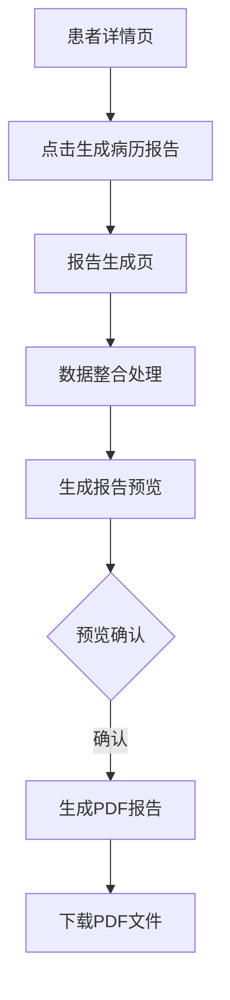

# 患者问诊病历报告系统需求文档

## 1. 产品概览
患者问诊病历报告系统是基于现有患者数据和治疗事件时间轴功能，为医疗专业人员提供的标准化病历报告生成工具。该系统旨在整合患者全病程数据，生成包含患者基本信息、诊断过程、治疗方案、检查结果等内容的PDF格式病历报告，为医疗决策和患者随访提供重要参考依据。

## 2. 核心功能

### 2.1 功能模块
| 模块名称 | 功能描述 |
|---------|---------|
| 报告生成管理 | 提供报告生成入口，基于当前患者ID生成病历报告 |
| 数据整合处理 | 从现有系统中提取并整合患者数据和治疗事件数据 |
| 报告预览功能 | 生成报告前可预览报告内容，确保数据准确性 |
| PDF导出功能 | 将生成的报告导出为PDF格式，支持下载和打印 |

### 2.2 页面详情
| 页面名称 | 模块名称 | 功能描述 |
|---------|---------|---------|
| 患者详情页 | 报告生成入口 | 在患者详情页添加"生成病历报告"按钮，点击后进入报告生成流程 |
| 报告生成页 | 报告预览 | 基于当前患者ID生成报告预览，展示报告的完整内容和格式 |
| 报告生成页 | PDF导出 | 提供PDF导出按钮，点击后生成并下载PDF格式的病历报告 |

## 3. 核心流程

## 4. 用户接口设计

### 4.1 设计风格
- **主色调**：医疗行业专业色调，以白色和浅蓝色为主
- **辅助色**：绿色（用于标题和重点信息）、灰色（用于次要信息）
- **字体**：宋体（中文）、Arial（英文），确保打印效果清晰
- **布局**：采用医疗行业标准病历格式，包含页眉、页脚和主体内容区域
- **图标**：使用简洁的医疗相关图标，如医院、病历、药品等

### 4.2 页面设计概览
| 页面名称 | 模块名称 | UI元素 |
|---------|---------|--------|
| 患者详情页 | 报告生成入口 | 新增"生成病历报告"按钮，位于页面操作区域，样式与现有按钮保持一致 |
| 报告生成页 | 报告预览 | 预览区域：以PDF格式展示报告内容，支持滚动查看 加载提示：数据整合和报告生成过程中显示加载状态 |
| 报告生成页 | PDF导出 | 导出按钮：点击后生成并下载PDF文件 进度提示：显示PDF生成进度 下载链接：生成完成后提供下载链接 |

### 4.3 自适应
- **桌面端**：优化显示效果，支持鼠标操作和键盘快捷键
- **移动端**：适配移动设备屏幕，支持触摸操作
- **打印适配**：确保生成的PDF报告适合A4纸张打印，页边距和字体大小合理

## 5. 数据需求

### 5.1 数据实体
| 实体名称 | 字段名称 | 数据类型 | 描述 | 来源 |
|---------|---------|---------|------|------|
| 患者信息 | patient_id | String | 患者唯一标识 | 现有患者数据 |
| 患者信息 | name | String | 患者姓名 | 现有患者数据 |
| 患者信息 | gender | Integer | 患者性别（1:男，2:女） | 现有患者数据 |
| 患者信息 | age | Integer | 患者年龄 | 现有患者数据 |
| 患者信息 | height | Float | 患者身高（cm） | 现有患者数据 |
| 患者信息 | weight | Float | 患者体重（kg） | 现有患者数据 |
| 患者信息 | phone | String | 患者联系方式 | 现有患者数据 |
| 基础病史 | disease_name | String | 疾病名称 | 现有患者数据 |
| 基础病史 | past_medical_history | String | 既往病史 | 现有患者数据 |
| 基础病史 | allergy_history | String | 过敏史 | 现有患者数据 |
| 基础病史 | family_history | String | 家族病史 | 现有患者数据 |
| 治疗事件 | event_id | String | 事件唯一标识 | 现有治疗事件数据 |
| 治疗事件 | patient_id | String | 关联患者ID | 现有治疗事件数据 |
| 治疗事件 | event_type | String/Integer | 事件类型（治疗、检查、用药等） | 现有治疗事件数据 |
| 治疗事件 | event_date | Date | 事件发生日期 | 现有治疗事件数据 |
| 治疗事件 | event_content | String | 事件内容 | 现有治疗事件数据 |
| 治疗事件 | hospital | String | 医疗机构 | 现有治疗事件数据 |
| 治疗事件 | doctor | String | 主治医生 | 现有治疗事件数据 |

### 5.2 数据接口
| 接口名称 | URL | 方法 | 功能描述 | 请求参数 | 成功响应 |
|---------|-----|------|---------|---------|----------|
| 患者信息查询 | /api/timeline/patients/{id} | GET | 获取患者详细信息 | patient_id: String | 患者信息对象 |
| 治疗事件查询 | /api/timeline/events | GET | 获取患者治疗事件 | patient_id: String | 治疗事件列表 |
| 报告生成 | /api/report/generate | POST | 生成病历报告 | patient_id: String | 报告预览数据 |
| PDF导出 | /api/report/export | POST | 导出PDF报告 | patient_id: String | PDF文件流 |

## 6. 技术实现方案

### 6.1 技术栈
| 分类 | 技术 | 版本 | 选型理由 |
|------|------|------|----------|
| 前端框架 | Taro | 4.1.5 | 与现有项目框架保持一致，支持多端适配 |
| UI组件 | Taro UI | 3.1.0 | 与Taro框架兼容，提供丰富的UI组件 |
| 后端语言 | Java | 11.0+ | 成熟稳定，适合企业级应用开发，拥有丰富的PDF生成库和生态系统 |
| 数据库 | MySQL | 8.0+ | 与现有系统数据库保持一致，确保数据兼容性 |
| PDF生成 | iText | 7.0+ | 功能强大的Java PDF生成库，支持复杂布局和中文处理 |
| 部署环境 | Docker | 20.0+ | 容器化部署，便于管理和扩展 |

### 6.2 关键技术实现
- **数据整合**：使用Java编写数据整合逻辑，从现有数据库中提取患者数据和治疗事件数据，按时间顺序和类型分类处理
- **报告模板**：使用HTML/CSS设计报告模板，结合iText库生成PDF格式
- **PDF生成**：采用服务器端PDF生成方案，确保生成速度和格式一致性
- **性能优化**：使用缓存机制减少数据库查询次数，优化PDF生成过程中的内存使用

### 6.3 集成方案
- **与现有系统集成**：在现有患者详情页添加报告生成入口，复用现有的用户认证和权限控制
- **数据流转**：通过API接口从现有系统中获取数据，确保数据的实时性和准确性
- **部署方式**：作为现有系统的一个模块进行部署，共享数据库和服务器资源

## 7. 测试计划

### 7.1 测试目标
- 验证报告生成功能的正确性和完整性
- 确保PDF导出功能正常工作，生成的PDF格式正确
- 测试系统在不同设备和浏览器上的兼容性
- 验证数据整合的准确性，确保报告内容与原始数据一致

### 7.2 测试内容
| 测试类型 | 测试内容 |
|---------|---------|
| 功能测试 | 报告生成流程测试：验证从选择患者到生成PDF的完整流程 |
| 功能测试 | 数据整合测试：验证系统能够正确提取和整合患者数据 |
| 功能测试 | 报告预览测试：验证报告预览功能的准确性和响应速度 |
| 功能测试 | PDF导出测试：验证PDF生成的格式和内容正确性 |
| 性能测试 | 响应时间测试：测试报告生成和PDF导出的响应时间 |
| 性能测试 | 并发测试：测试系统在多用户同时生成报告时的稳定性 |
| 兼容性测试 | 浏览器兼容性：测试系统在不同浏览器中的表现 |
| 兼容性测试 | 设备兼容性：测试系统在不同设备上的表现 |

### 7.3 测试用例
| 测试用例ID | 测试用例名称 | 测试步骤 | 预期结果 |
|-----------|-------------|---------|----------|
| TC001 | 报告生成入口功能 | 1. 进入患者详情页 2. 点击"生成病历报告"按钮 | 系统跳转到报告生成页，开始数据整合和报告生成 |
| TC002 | 报告预览功能 | 1. 等待报告预览加载完成 2. 查看报告预览内容 3. 检查数据准确性和格式正确性 | 预览内容与原始数据一致，格式符合要求 |
| TC003 | PDF导出功能 | 1. 点击PDF导出按钮 2. 等待PDF生成 3. 下载PDF文件 | 系统成功生成PDF文件，文件内容与预览一致 |
| TC004 | 数据整合测试 | 1. 进入患者详情页 2. 点击"生成病历报告"按钮 3. 对比报告内容与原始数据 | 报告内容与原始数据完全一致 |

## 8. 项目计划

### 8.1 项目阶段
| 阶段名称 | 时间周期 | 主要任务 |
|---------|---------|---------|
| 需求分析与设计 | 2周 | 完成需求分析、技术方案设计和系统架构设计 |
| 前端开发 | 3周 | 实现报告生成页面、预览功能和用户交互 |
| 后端开发 | 3周 | 实现数据整合逻辑、PDF生成功能和API接口 |
| 测试与优化 | 2周 | 完成功能测试、性能测试和兼容性测试，优化系统性能 |
| 部署上线 | 1周 | 系统部署、用户培训和文档编写 |

### 8.2 资源需求
| 资源类型 | 数量 | 职责 |
|---------|------|------|
| 产品经理 | 1 | 需求分析、产品设计和项目管理 |
| 前端开发 | 2 | 实现前端页面和用户交互 |
| 后端开发 | 2 | 实现Java后端逻辑和PDF生成功能 |
| 测试工程师 | 1 | 完成系统测试和质量保证 |
| 医疗顾问 | 1 | 提供医疗专业知识和报告格式指导 |

## 9. 风险评估

### 9.1 风险识别
| 风险名称 | 风险描述 | 影响程度 | 发生概率 |
|---------|---------|---------|----------|
| 数据完整性风险 | 现有系统数据不完整或格式不一致，可能导致报告内容缺失 | 高 | 中 |
| 性能风险 | 生成PDF时处理大量数据可能导致系统响应缓慢 | 中 | 中 |
| 格式一致性风险 | 不同设备和浏览器生成的PDF格式可能存在差异 | 中 | 低 |
| 权限风险 | 病历报告包含敏感信息，需要严格的权限控制 | 高 | 低 |

### 9.2 风险应对策略
| 风险名称 | 应对策略 |
|---------|----------|
| 数据完整性风险 | 实现数据校验机制，对缺失数据进行标记和提示；建立数据清洗流程，确保数据格式一致性 |
| 性能风险 | 使用异步处理和缓存机制优化PDF生成过程；限制单次生成报告的数据量，支持分批处理 |
| 格式一致性风险 | 使用服务器端PDF生成方案，确保格式一致性；进行多设备兼容性测试，优化PDF生成参数 |
| 权限风险 | 继承现有系统的权限控制机制；对PDF文件添加水印和访问控制；实现操作日志记录 |

## 10. 附录

### 10.1 术语定义
| 术语 | 解释 |
|------|------|
| 病历报告 | 记录患者诊疗过程的医疗文档，包含患者基本信息、诊断结果、治疗方案等内容 |
| 治疗事件 | 患者在治疗过程中发生的具体事件，如手术、化疗、检查等 |
| 时间轴 | 按时间顺序展示患者治疗事件的可视化界面 |
| PDF | Portable Document Format，一种用于文档交换的标准格式，确保文档在不同设备上的显示一致性 |
| 数据整合 | 将分散在不同系统中的数据提取、转换和加载到统一的数据模型中 |

### 10.2 参考资料
- 《医疗机构病历管理规定》
- 《电子病历应用管理规范》
- 现有患者管理系统技术文档
- 现有治疗事件时间轴功能技术文档
- 医疗行业病历报告标准格式示例