# 壹鹿康行小程序 - 功能架构图

## 整体功能架构图

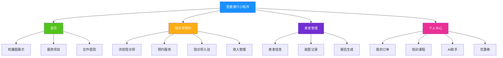

## 用户核心使用流程图

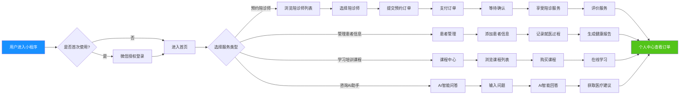

## 核心功能模块详解图

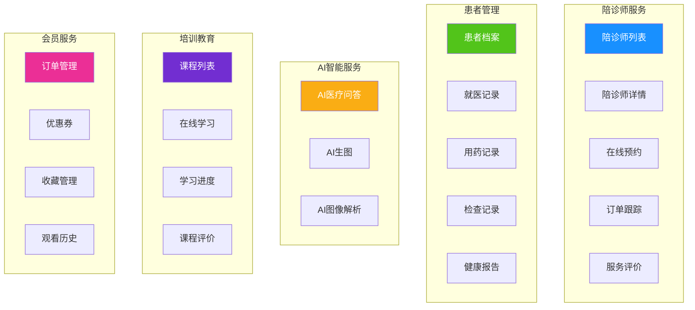

## 陪诊师入驻流程图

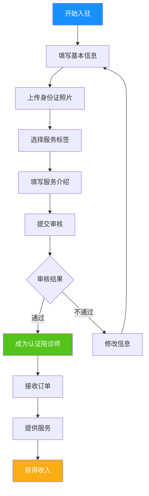

## 患者就医管理流程图

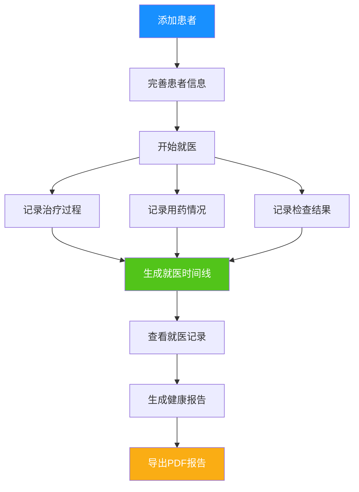

## AI助手功能图

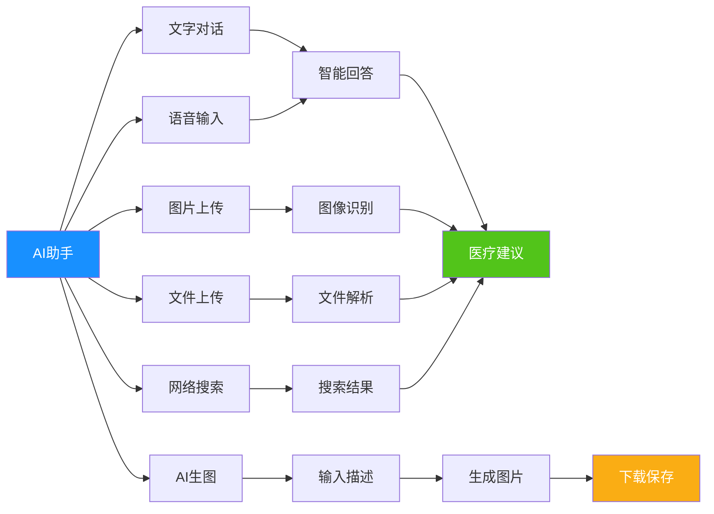

## 订单流程图

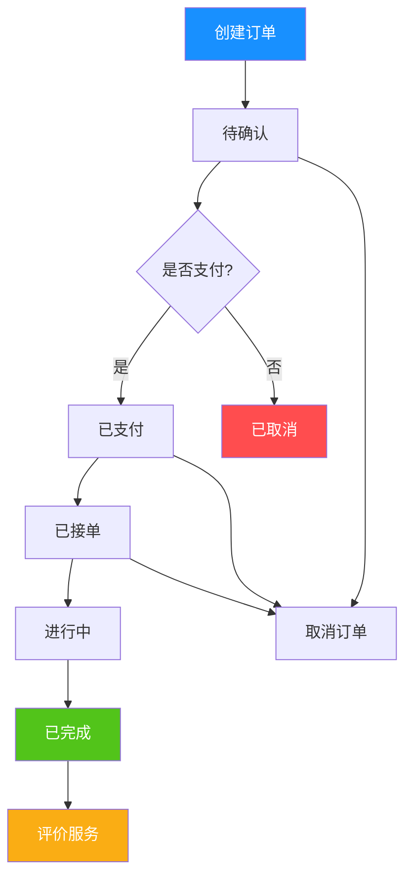

## 课程学习流程图

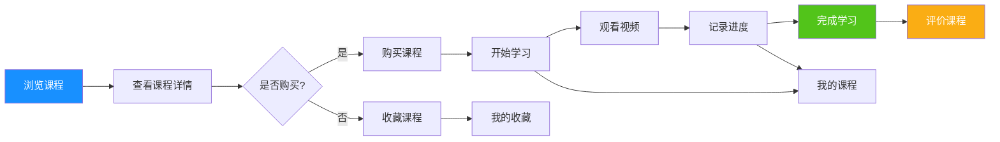

## 平台价值主张图

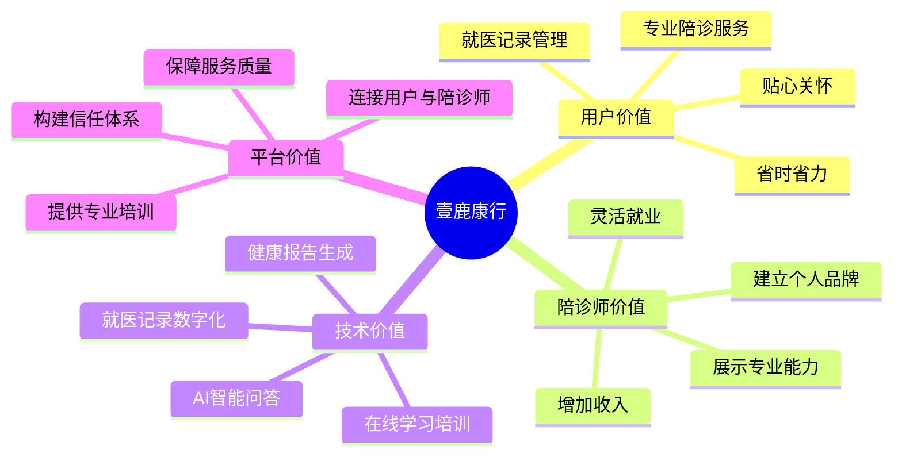

## 核心竞争力图

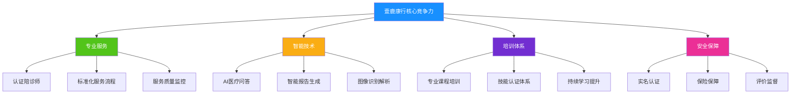

## 用户使用场景图

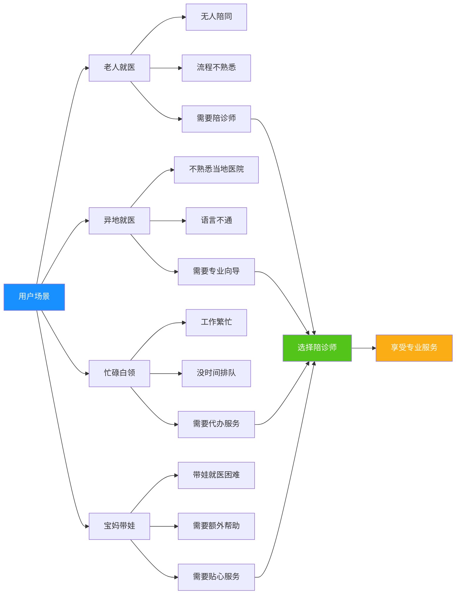

## 数据流转图

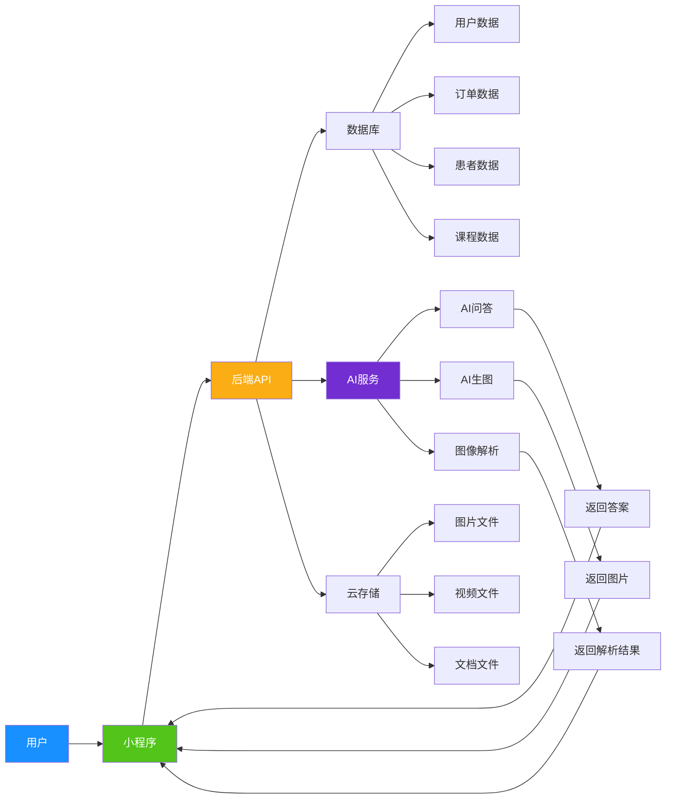

## 平台生态图

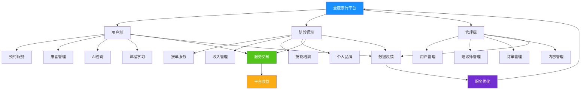

## 使用说明

以上功能架构图可以使用支持Mermaid语法的工具查看，例如：

1. **在线查看工具：**
   - [Mermaid Live Editor](https://mermaid.live/)
   - [GitHub](https://github.com/) (直接在README中显示)
   - [Typora](https://typora.io/) (Markdown编辑器)

2. **使用方法：**
   - 复制上面的Mermaid代码块
   - 粘贴到支持Mermaid的工具中
   - 即可看到可视化的功能架构图

3. **图表说明：**
   - **整体功能架构图：** 展示小程序的四大核心模块
   - **用户核心使用流程图：** 展示用户从进入小程序到完成服务的完整流程
   - **核心功能模块详解图：** 详细展示每个功能模块的子功能
   - **陪诊师入驻流程图：** 展示陪诊师从申请到接单的完整流程
   - **患者就医管理流程图：** 展示患者信息管理和就医记录流程
   - **AI助手功能图：** 展示AI助手的各种功能
   - **订单流程图：** 展示订单从创建到完成的完整流程
   - **课程学习流程图：** 展示课程浏览、购买、学习的流程
   - **平台价值主张图：** 展示平台为各方带来的价值
   - **核心竞争力图：** 展示平台的核心竞争优势
   - **用户使用场景图：** 展示不同用户群体的使用场景
   - **数据流转图：** 展示数据在各系统间的流转
   - **平台生态图：** 展示平台的完整生态体系

这些图表可以帮助您更好地向客户讲解壹鹿康行小程序的功能和价值。